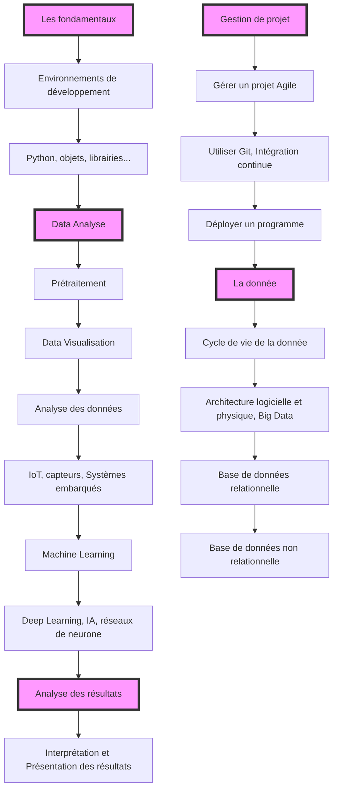

# Présentation du programme



# Introduction

## Historique

L'Intelligence Artificielle (IA) est un domaine de l'informatique qui vise à créer des ordinateurs **capables de réaliser des tâches qui nécessitent de l'intelligence humaine**, comme la reconnaissance de la parole, la traduction de langues, l'analyse de données et la prise de décision. Le Machine Learning, quant à lui, est un sous-domaine de l'IA qui consiste à donner aux ordinateurs la capacité d'apprendre sans être explicitement programmés.

L'histoire de l'IA remonte aux années 1950, lorsque des scientifiques et des philosophes ont commencé à s'intéresser à la possibilité de créer des machines capables de raisonnement. Le terme **"Intelligence Artificielle"** a été popularisé par **John McCarthy en 1956**, lors d'un colloque organisé à Dartmouth. Au cours des années 1960 et 1970, de nombreux progrès ont été réalisés dans le domaine de l'IA, notamment en matière de reconnaissance de la parole et de traduction automatique. Cependant, l'IA a connu une période de stagnation au cours des années 1980 et 1990 en raison du **manque de puissance de calcul** des ordinateurs et de la **faible quantité de données disponibles**.

Le Machine Learning a émergé au milieu des années 1980, grâce aux progrès réalisés dans le domaine de l'IA et à **l'augmentation de la puissance de calcul des ordinateurs**. Cette approche a été utilisée avec succès dans de nombreux domaines, notamment la reconnaissance de la parole, la traduction automatique et la reconnaissance d'images.

Au cours des années 2000, l'IA et le Machine Learning ont connu un regain d'intérêt grâce aux progrès réalisés dans le domaine de l'apprentissage automatique et à **l'augmentation de la disponibilité de données**. Depuis lors, l'IA et le Machine Learning ont été utilisés dans de nombreux domaines, notamment la finance, la santé, la robotique et les transports. L'IA et le Machine Learning continuent de faire l'objet de recherches intensives et ont le potentiel de transformer de nombreux aspects de notre vie quotidienne.

## Différence entre IA, Machine Learning et Big Data

L'intelligence artificielle (IA), le machine learning (apprentissage automatique) et le big data sont tous des domaines liés qui utilisent des techniques informatiques avancées pour traiter et analyser de grandes quantités de données. Cependant, ils ont des fonctions et des objectifs différents:

- **L'IA**: L'IA est un domaine de la science informatique qui vise à créer des machines capables de simuler l'intelligence humaine. Elle utilise différentes techniques, telles que l'apprentissage automatique et le traitement du langage naturel, pour résoudre des problèmes complexes de manière autonome.

- **Apprentissage automatique**: L'apprentissage automatique est une technique de l'IA qui consiste à entraîner un modèle de données à partir d'exemples précédemment observés afin de prédire des résultats futurs. Le modèle est capable de s'adapter et de s'améliorer au fur et à mesure qu'il reçoit de nouvelles données.

- **Big data**: Le big data est un terme qui désigne de grandes quantités de données structurées et non structurées qui sont difficiles à traiter et à analyser avec des outils traditionnels. Les technologies du big data permettent de collecter, de stocker et d'analyser ces données à grande échelle afin de découvrir de nouvelles informations et de prendre des décisions basées sur ces dernières.

En résumé, l'IA est un domaine qui vise à créer des machines intelligentes, tandis que l'apprentissage automatique est une technique de l'IA qui utilise des données pour entraîner des modèles de prédiction. Le big data est un terme qui désigne de grandes quantités de données et les technologies permettant de les traiter et de les analyser. Tous ces domaines sont étroitement liés et interdépendants.

## Quelques notions de complexité

La complexité algorithmique **est une mesure de la performance d'un algorithme** en fonction de la taille des données sur lesquelles il opère. Elle permet de savoir combien de temps et de ressources un algorithme va prendre pour exécuter une tâche donnée en fonction de la taille des données d'entrée.

Il existe plusieurs façons de mesurer la complexité algorithmique, mais l'une des plus courantes est de regarder le nombre d'opérations que l'algorithme doit effectuer pour exécuter la tâche. Par exemple, si un algorithme doit parcourir une liste de données et effectuer une opération sur chaque élément, sa complexité sera **proportionnelle à la taille de la liste**. Si la liste contient n éléments, l'algorithme devra effectuer n opérations, ce qui donne une complexité de O(n).

**Les heuristiques sont des méthodes qui permettent de résoudre des problèmes de manière rapide et approximative**, plutôt que de trouver la solution optimale. Elles sont souvent utilisées lorsque le temps ou les ressources disponibles sont limités, ou **lorsque la recherche de la solution optimale serait trop coûteuse en termes de temps ou de ressources**.

Les **IA peuvent être de bonnes heuristiques dans certaines situations**, car elles peuvent apprendre à partir de données et trouver des modèles qui permettent de résoudre des problèmes de manière efficace. Par exemple, une IA peut être entraînée à partir de données médicales pour aider à diagnostiquer des maladies, ou à partir de données financières pour prévoir des tendances de marché. En utilisant ces modèles appris, l'IA peut fournir des recommandations de manière rapide et précise, même si elle n'a pas accès à toutes les informations nécessaires pour trouver la solution optimale.

Il est important de noter que les heuristiques ne sont pas toujours la meilleure solution et peuvent parfois donner des résultats inexacts ou incomplets. Cependant, dans certains cas, elles peuvent être utiles pour obtenir rapidement des résultats satisfaisants, même si ceux-ci ne sont pas parfaits.

## Quelques exemples de projets

### GPT3

GPT-3 **(Generative Pre-trained Transformer 3)** est un modèle de langage développé par OpenAI. C'est l'un des modèles de langage pré-entraînés les plus avancés et les plus performants disponibles à ce jour.

Ce dernier utilise un processus appelé *pré-entraînement* pour apprendre à partir de vastes quantités de données de textes en ligne. Ensuite, il utilise ce qu'il a appris pour effectuer diverses tâches de traitement du langage naturel, comme la traduction, la résumé de texte, la génération de texte et la reconnaissance de la parole.

GPT-3 est également connu pour sa capacité à **générer du texte de manière autonome**, en utilisant ce qu'il a appris pendant son pré-entraînement. Cela lui permet de produire du contenu de qualité supérieure, comme des articles de presse, des résumés de livres et même des scripts de films.

Quelques applications de GPT3 :
- https://chat.openai.com/chat
- https://github.com/features/copilot

#### Volume de donnés d'entrée

GPT-3 a été entraîné sur un très grand volume de données, comprenant des milliards de phrases et de mots provenant de diverses sources en ligne. Selon **OpenAI**, GPT-3 a été entraîné sur *175 milliards de paramètres*, ce qui en fait l'un des modèles de langage les plus performants disponibles à ce jour.

Il est difficile de dire exactement combien de temps a pris l'entraînement de GPT-3, car cela dépend de nombreux facteurs tels que la puissance de calcul utilisée, la taille des données et les algorithmes utilisés. Cependant, l'entraînement d'un modèle de langage de cette envergure peut prendre des semaines, voire des mois.

### DeepL

**DeepL** est une société de technologie d'intelligence artificielle (IA) basée à Cologne, en Allemagne. Elle a développé une plateforme de traduction automatique en ligne qui utilise l'IA pour traduire des textes de manière rapide et précise.

DeepL utilise des réseaux de neurones pour effectuer la traduction automatique. Plus précisément, il utilise des modèles de traduction automatique **encoder-decoder**, qui sont des réseaux de neurones qui sont entraînés sur **des paires de phrases dans différentes langues**. L'encoder encode la phrase d'entrée dans une représentation numérique, tandis que le décodeur utilise cette représentation pour générer la traduction en sortie.

DeepL a été lancé en 2017 et a rapidement gagné en popularité grâce à sa **qualité de traduction supérieure** à celle de ses concurrents. Il prend en charge de nombreuses langues, notamment l'anglais, l'allemand, le français, l'espagnol, le néerlandais et le russe. DeepL est utilisé par de nombreuses entreprises et organisations pour la traduction de documents et de contenu en ligne.

Leur site web :

https://www.deepl.com/fr/translator

### Dall-Emini

Dall-Emini est un modèle d'intelligence artificielle (IA) développé par **OpenAI** qui est capable de **générer des images à partir de descriptions textuelles**. Dall-Emini est basé sur le modèle Dall-E, qui est un modèle de génération d'images de haute qualité qui a été pré-entraîné sur un grand ensemble de données d'images et de descriptions textuelles.

Dall-Emini est une version plus petite et plus rapide de Dall-E qui a été optimisée pour être exécutée sur des périphériques mobiles et des ordinateurs de bureau de faible puissance de calcul. Il est capable de générer des images de qualité comparable à celles générées par Dall-E, mais avec une latence inférieure et une meilleure évolutivité.

Dall-Emini peut être utilisé pour de nombreuses tâches de génération d'images, telles que la création de visuels pour les réseaux sociaux, la génération de maquettes de produits et la création de visuels pour les campagnes publicitaires. Il peut également être utilisé pour des tâches plus complexes, telles que la génération de contenu de jeux vidéo ou la création de visuels pour l'industrie du cinéma et du divertissement.

Leur site web :

https://www.craiyon.com/


### DeepMind 

DeepMind est une entreprise de recherche en intelligence artificielle (IA) basée à Londres, en Angleterre. Elle a été fondée en 2010 et a été achetée par Google en 2014.

DeepMind se concentre principalement sur le développement de technologies d'IA avancées, notamment en utilisant des réseaux de neurones profonds (Deep Learning). L'entreprise a réalisé plusieurs progrès significatifs dans le domaine de l'IA, notamment en créant des programmes capables de battre des champions du monde dans des jeux complexes comme Go et Starcraft II.

En plus de ses recherches en IA, DeepMind s'intéresse également à d'autres domaines tels que la santé, la science des données et l'énergie. L'entreprise s'efforce de développer des technologies qui peuvent avoir un impact positif sur la société et l'environnement.

### IBM Watson

IBM Watson est une plateforme de technologie de l'information développée par IBM qui utilise l'apprentissage automatique et l'analyse de données pour fournir des solutions de pointe dans divers domaines, tels que la médecine, la finance, la technologie de l'information et les médias.

En ce qui concerne la médecine, IBM Watson peut être utilisé pour aider à diagnostiquer et traiter les patients, en utilisant des données médicales volumineuses et en proposant des recommandations de traitement basées sur l'analyse de ces données. Par exemple, IBM Watson peut être utilisé pour analyser les dossiers médicaux des patients, les résultats de tests et les antécédents médicaux pour aider les médecins à établir un diagnostic et à planifier le traitement le plus approprié.

IBM Watson peut également être utilisé pour améliorer l'efficacité des processus de soins de santé en automatisant certaines tâches, comme la gestion des rendez-vous et la préparation de dossiers médicaux. En outre, IBM Watson peut être utilisé pour aider à la recherche médicale en analysant les données cliniques et en identifiant des tendances et des patterns qui peuvent être utiles pour la compréhension de certaines maladies et pour le développement de nouveaux traitements.

Leur site web :

https://www.ibm.com/fr-fr/watson

# L'environnement de développement

## Python

Python est un langage de programmation populaire et polyvalent qui peut être **utilisé dans de nombreux domaines**, tels que **la science des données**, le développement web, la création de logiciels et l'automatisation de tâches. Il est connu pour **sa syntaxe claire et concise**, qui le rend facile à apprendre et à lire pour les débutants.

Le nom "Python" vient du nom du groupe comique britannique Monty Python, dont le fondateur du langage, **Guido van Rossum**, était un fan. Van Rossum a choisi ce nom parce qu'il trouvait que c'était un nom amusant et qu'il ne s'attendait pas à ce que le langage devienne aussi populaire qu'il l'est devenue.

## Python 2 ou Python 3

Il existe deux versions principales de Python: Python 2 et Python 3. **Python 3 est la version la plus récente et la plus recommandée**, car elle incorpore de nombreuses améliorations et corrections de bugs par rapport à Python 2.

Toutefois, Python 2 est toujours utilisé dans certains projets en raison de sa compatibilité avec les versions antérieures du code. Si vous débutez en programmation avec Python, il est recommandé de commencer avec Python 3.

Voici quelques différences clés **entre les deux versions**:

- **Syntaxe**: Python 3 a quelques différences de syntaxe par rapport à Python 2, notamment la suppression de certaines fonctionnalités obsolètes et l'ajout de nouvelles fonctionnalités.

- **Bibliothèques**: Certaines bibliothèques populaires ne sont pas compatibles avec Python 3, ou le sont seulement depuis une version récente. Si vous utilisez une bibliothèque qui n'est pas compatible avec Python 3, vous devrez utiliser Python 2.

- **Fin de vie**: Python 2 a atteint sa fin de vie en janvier 2020 et ne recevra plus de mises à jour de sécurité. Si vous utilisez toujours Python 2, il est recommandé de passer à Python 3 le plus tôt possible.

En résumé, **si vous débutez en programmation avec Python, commencez avec Python 3**. Si vous utilisez déjà Python 2 dans un projet et que vous ne pouvez pas passer à Python 3 pour le moment, continuez à utiliser Python 2 jusqu'à ce que vous puissiez passer à Python 3 sans trop de problèmes.

## Anaconda

Anaconda est une distribution de Python qui inclut un ensemble de bibliothèques et d'outils populaires pour le calcul scientifique, l'analyse de données et l'apprentissage automatique. Voici les étapes pour installer Anaconda sur votre ordinateur:

- **Téléchargez l'installateur Anaconda**: allez sur le site Web d'Anaconda (https://www.anaconda.com/) et cliquez sur le lien *Download* pour télécharger l'installateur Anaconda pour votre système d'exploitation.

- **Exécutez l'installateur**: double-cliquez sur l'installateur téléchargé pour lancer l'assistant d'installation. Suivez les instructions à l'écran pour installer Anaconda.

- **Configurez votre environnement**: lorsque vous êtes invité à configurer votre environnement, sélectionnez l'option *Just Me* pour installer Anaconda uniquement pour votre utilisateur. Si vous souhaitez que tous les utilisateurs de l'ordinateur puissent accéder à Anaconda, sélectionnez l'option *All Users*.

- **Terminez l'installation**: suivez les instructions à l'écran pour terminer l'installation d'Anaconda. Une fois l'installation terminée, vous devriez être en mesure d'exécuter des programmes Python en utilisant l'interpréteur Python inclu dans Anaconda.

Voici la page à laquelle vous aurez accès une foi l'installation terminée :


## Virtual Environement

Un environnement virtuel (ou *virtual environment* en anglais) est un outil qui vous permet de créer et de gérer des environnements Python séparés sur votre ordinateur. Cela peut être utile **lorsque vous travaillez sur plusieurs projets Python qui nécessitent des versions différentes de bibliothèques ou de packages**.

En utilisant un environnement virtuel, vous pouvez créer un **espace de travail isolé pour chaque projet**. Cela signifie que vous pouvez avoir des versions différentes de bibliothèques et de packages installées pour chaque projet, sans craindre que cela n'affecte les autres projets. De cette manière, vous pouvez travailler sur des projets qui ont des exigences de dépendances différentes sans avoir à gérer les conflits entre eux.

Pour créer un environnement virtuel en Python, vous pouvez utiliser la bibliothèque *venv* qui est incluse dans Python depuis la version 3.3. Voici comment créer un environnement virtuel avec *venv*:

- Ouvrez un terminal et naviguez jusqu'au répertoire où vous souhaitez créer votre environnement virtuel.

- Exécutez la commande suivante pour créer un environnement virtuel nommé "monenv":

```console
python -m venv monenv
```
- Activez votre environnement virtuel en exécutant la commande suivante:
```console
source monenv/bin/activate
```
- Votre environnement virtuel est maintenant actif et vous pouvez commencer à y travailler. Pour désactiver l'environnement virtuel, utilisez la commande suivante:

```console
deactivate
```

Je vous recommande de vous référer à la documentation de Python pour obtenir des instructions plus détaillées sur la création et l'utilisation d'environnements virtuels avec "venv".

## IDE

Un IDE (Integrated Development Environment, ou Environnement de Développement Intégré en français) est **un logiciel qui fournit un ensemble d'outils pour le développement** de logiciels. Il peut inclure des **éditeurs de code**, des **débogueurs**, des **visualiseurs de données** et d'autres fonctionnalités qui facilitent le processus de développement.

Voici quelques exemples populaires d'IDE Python:

- **PyCharm**: un IDE complet conçu spécifiquement pour Python, avec de nombreuses fonctionnalités de débogage et de développement avancées.

- **IDLE**: un IDE intégré qui est livré avec Python par défaut. Il est simple à utiliser et convient aux débutants, mais il peut être moins complet que d'autres IDE.

- **Visual Studio Code**: un éditeur de code polyvalent qui peut être utilisé pour le développement de Python et de nombreux autres langages. Il inclut des fonctionnalités de débogage et de développement avancées.

- **Spyder**: un IDE conçu spécifiquement pour la science des données et l'analyse de données en Python, avec des outils tels que des visualiseurs de données et des notebooks Jupyter intégrés.

Il existe de nombreux autres IDE Python disponibles, chacun ayant ses propres caractéristiques et fonctionnalités. Le choix de l'IDE dépend de vos préférences personnelles et de vos besoins en matière de développement. Vous devriez essayer plusieurs IDE différents et voir celui qui vous convient le mieux.

## Jupyter Notebook

Jupyter Notebook est un outil open-source qui permet de créer et partager des documents interactifs contenant du code, du texte, des équations et des visualisations de données. Il est particulièrement utile pour l'analyse de données et la science des données, car il permet de combiner du code, des résultats et des explications de manière cohérente dans un même document.

### Les cellules de code

Voici quelques raccourcis clavier utiles pour utiliser Jupyter Notebook:

- Pour exécuter le code dans une cellule de code, utilisez la combinaison de touches "Maj + Entrée".

- Pour créer une nouvelle cellule de code en dessous de la cellule actuelle, utilisez la combinaison de touches "Esc + b".

- Pour créer une nouvelle cellule de code au-dessus de la cellule actuelle, utilisez la combinaison de touches "Esc + a".

- Pour passer en mode édition de cellule (permettant de modifier le contenu de la cellule), utilisez la combinaison de touches "Entrée".

- Pour passer en mode commande (permettant de naviguer entre les cellules et d'exécuter des commandes), utilisez la combinaison de touches "Esc".

### Les cellules de texte

Voici également quelques raccourcis clavier utiles pour utiliser le langage de mise en forme **Markdown** dans Jupyter Notebook:

Pour mettre en gras du texte, entourez le texte de deux astérisques: **texte en gras**

Pour mettre en italique du texte, entourez le texte d'une seule astérisque: *texte en italique*

Pour créer une liste à puces, utilisez un tiret suivi d'un espace pour chaque élément de la liste:

- élément 1
- élément 2
- élément 3

Pour créer une liste numérotée, utilisez un nombre suivi d'un point et d'un espace pour chaque élément de la liste:

1. élément 1
2. élément 2
2. élément 3

Il existe de nombreux autres raccourcis clavier et syntaxes de mise en forme Markdown disponibles pour formater du texte dans Jupyter Notebook. Vous pouvez trouver une liste complète des raccourcis clavier et de la syntaxe Markdown dans la documentation de Jupyter Notebook.

### Mode en ligne 

Les avantages de Jupyter Notebook en ligne sont :

- **Facilité d'utilisation** : Jupyter Notebook est très simple à utiliser et permet de créer des documents interactifs rapidement.
- **Interactivité** : Jupyter Notebook permet d'exécuter du code et d'afficher les résultats dans les cellules du document, ce qui rend l'exploration de données et le développement de code beaucoup plus faciles.
- **Partage et collaboration** : Jupyter Notebook permet de partager et de collaborer facilement sur des documents avec d'autres personnes.
- **Support de nombreux langages de programmation** : Jupyter Notebook prend en charge de nombreux langages de programmation, ce qui en fait un outil polyvalent pour le développement de code.

Les inconvénients de Jupyter Notebook en ligne sont :

- **Ressources limitées** : l'exécution de code intensif en ressources peut être limitée par les ressources allouées à votre compte Jupyter Notebook en ligne.
- **Connexion Internet nécessaire** : Jupyter Notebook en ligne nécessite une connexion Internet pour fonctionner, ce qui peut être un inconvénient si vous êtes dans un endroit où la connexion est instable ou inexistante.

Il existe plusieurs services en ligne qui proposent Jupyter Notebook, tels que Google Colaboratory, Microsoft Azure Notebooks et Kaggle Kernels. Chacun de ces services a ses propres avantages et inconvénients, mais ils sont tous largement utilisés par les développeurs et les scientifiques de données pour créer et partager des documents interactifs.


# Les bases du langage Python

## Les types de données

En Python, il existe plusieurs types de données qui permettent de représenter différents types de valeurs :

- Les `int` (entiers) représentent des nombres entiers positifs ou négatifs. Par exemple : `42`, `-10`, `0`.

- Les `float` (flottants) représentent des nombres à virgule flottante (des nombres décimaux). Par exemple : `3.14`, `-0.01`, `0.0`.

- Les `bool` (booléens) représentent deux valeurs : `True` (vrai) et `False` (faux). Ils sont souvent utilisés pour représenter des conditions dans le code.

- Les `str` (chaînes de caractères) représentent des séquences de caractères. Elles peuvent être définies soit avec des guillemets simples (') ou doubles ("). Par exemple : `"Bonjour"`, `'Hello'`, `"123"`.

## Déclarer une variable

Pour déclarer une variable en Python, vous devez simplement **lui attribuer une valeur en utilisant le signe "="**. Par exemple:

```python
x = 5
y = "hello"
z = [1, 2, 3]
```

**Il n'est pas nécessaire de déclarer le type** de la variable lors de sa déclaration, car Python utilise **un typage dynamique**, ce qui signifie que **le type d'une variable peut changer pendant l'exécution du programme**. Par exemple, la variable "x" peut être initialement définie comme un entier, mais elle peut être redéfinie plus tard comme une chaîne de caractères:

```python
x = 5
print(type(x))  # affiche "<class 'int'>"

x = "hello"
print(type(x))  # affiche "<class 'str'>"
```

Il est également possible de déclarer plusieurs variables en une seule ligne en utilisant la syntaxe suivante:

```python
x, y, z = 1, 2, 3
```

## Les opérateurs 

En Python, il existe plusieurs types d'opérateurs qui peuvent être utilisés pour effectuer des calculs et des comparaisons.

Voici quelques exemples d'opérateurs couramment utilisés en Python :

1. Opérateurs arithmétiques : ces opérateurs permettent d'effectuer des calculs de base comme **l'addition, la soustraction, la multiplication et la division**.
2. Opérateurs de comparaison : ces opérateurs permettent de comparer des valeurs et de retourner un booléen indiquant si la comparaison est vraie ou fausse. Les opérateurs de comparaison incluent l'égalité **(==)**, l'inégalité **(!=)**, la supériorité **(>)**, l'infériorité **(<)** et les opérateurs de supériorité et d'infériorité stricts **(>= et <=)**.
3. Opérateurs de décalage de bits : ces opérateurs permettent de décaler les bits d'un nombre entier vers la gauche ou vers la droite.
4. Opérateurs logiques : ces opérateurs permettent de combiner plusieurs booléens en utilisant des opérations logiques comme l'ET logique **(and)**, l'OU logique **(or)** et la négation logique **(not)**.
5. Opérateurs de membre et d'appartenance : ces opérateurs permettent de vérifier si un élément est membre d'un ensemble ou si un élément appartient à un objet **(in)**.
6. Opérateurs d'identité : ces opérateurs permettent de vérifier si deux objets sont identiques ou non **(is)**.

Il est important de noter que l'ordre de priorité des opérateurs en Python suit le même ordre que celui utilisé en mathématiques. Par exemple, les opérations de multiplication et de division ont une priorité supérieure à celle de l'addition et de la soustraction. Si vous voulez changer l'ordre de priorité des opérations, vous pouvez utiliser des parenthèses pour grouper des expressions.

## La structure du code

Une subtilité du langage Python est qu'il utilise des indentations pour déterminer la structure du code. En Python, les blocs de code sont définis par l'indentation au lieu d'être encadrés par des accolades comme dans d'autres langages de programmation. Cela signifie que l'indentation du code doit être cohérente et que vous devez être vigilant à ne pas oublier d'indenter correctement le code. Par exemple:

```python
if x < 10:
    print("x est inférieur à 10")
    x = x + 1
```

Dans cet exemple, la ligne **print("x est inférieur à 10")** est indentée, ce qui signifie qu'elle fait partie du bloc de code exécuté si la condition "x < 10" est vraie. Si vous oubliez l'indentation, votre code peut ne pas fonctionner comme prévu.

## Les conditions

Les conditions dans le code servent à prendre des décisions basées sur des tests booléens (vrai ou faux). Elles permettent de déterminer si un bloc de code doit être exécuté ou non. Cela permet d'ajuster le comportement du programme en fonction des résultats des tests. Les conditions sont souvent utilisées pour gérer des scénarios complexes et pour contrôler le flux d'exécution du programme.

La syntaxe pour écrire une condition `if` en Python est la suivante:

```python
if condition:
  # code à exécuter si la condition est vraie (True)
else:
  # code à exécuter si la condition est fausse (False)
```

Exemple :

```python
x = 10

if x > 5:
  print("x est plus grand que 5")
else:
  print("x est plus petit ou égal à 5")
```

## Les librairies

En Python, une librairie est un ensemble de fonctions, de classes et de modules qui peuvent être utilisés pour accomplir diverses tâches. Les librairies Python sont souvent utilisées pour simplifier le développement de programmes et pour accéder à des fonctionnalités avancées.

Il existe de nombreuses librairies Python disponibles pour diverses applications, notamment le traitement de données, la création de graphiques, la manipulation de fichiers, le développement de réseaux, etc.

Voici quelques exemples de librairies couramment utilisées en Python :

- **NumPy** : une librairie de manipulation de tableaux et de calcul scientifique
- **Pandas** : une librairie de manipulation de données qui permet de travailler avec des tableaux et des séries de données
- **Matplotlib** : une librairie de visualisation de données qui permet de créer des graphiques et des figures
- **Scikit-learn** : une librairie de machine learning qui fournit de nombreux outils pour l'apprentissage automatique
- **TensorFlow** : une librairie de deep learning qui permet de créer et de déployer des modèles de machine learning de haute qualité

1. Pour utiliser une librairie en Python, vous devez d'abord l'installer sur votre ordinateur. Vous pouvez utiliser le gestionnaire de paquets Python (pip) pour installer la librairie. Une fois installée, vous pouvez l'importer dans votre programme en utilisant l'instruction import. Par exemple, pour importer la librairie NumPy, vous pouvez utiliser la ligne de code suivante : 

```python
import numpy as np
# Vous pouvez maintenant utiliser toutes les fonctions du module comme ceci :
resultat = mon_module.ma_fonction(arg1, arg2)
```

2. Vous pouvez également importer uniquement certaines parties d'une librairie en utilisant l'instruction from. Par exemple, pour importer uniquement la fonction sin du module math, vous pouvez utiliser la ligne de code suivante : 

```python
from math import sin
# Vous pouvez maintenant utiliser la fonction comme ceci :
resultat = ma_fonction(arg1, arg2)
```

3. Si vous voulez importer toutes les fonctions d'un module sous un autre nom, vous pouvez utiliser l'instruction `import` suivie du nom du module et de l'instruction `as` suivie du nouveau nom de votre choix. Par exemple :

```python
import mon_module as mm
# Vous pouvez maintenant utiliser toutes les fonctions du module comme ceci :
resultat = mm.ma_fonction(arg1, arg2)
```

4. Il est important de noter que certaines librairies Python sont déjà installées avec Python et Anaconda et peuvent être utilisées sans avoir besoin de les installer. Ces librairies sont appelées librairies standard.

**Note :** Il est possible d'importer des fonctions d'un autre scripte python de la même manière que pour les librairies.

## Les entrées et sorties

Il y a plusieurs façons de gérer les entrées et les sorties (E/S) en Python. Voici quelques exemples de comment gérer les entrées et les sorties en Python:

### Entrée

- Utilisation de l'instruction input pour lire une entrée de l'utilisateur à partir de la console:

```python
nom = input("Entrez votre nom: ")
print(f"Bonjour, {nom}!")
```

Utilisation de la fonction open du module io pour lire un fichier:

```python
from io import open

# Ouvre le fichier en mode lecture
fichier = open("mon_fichier.txt", "r")

# Lit le contenu du fichier
contenu = fichier.read()

# Ferme le fichier
fichier.close()

print(contenu)
```

### Sortie

- Utilisation de l'instruction print pour afficher du texte à la console:

```python
print("Ceci est un message de sortie.")
```

- Utilisation de la fonction open du module io pour écrire dans un fichier:

```python
from io import open

# Ouvre le fichier en mode écriture
fichier = open("mon_fichier.txt", "w")

# Écrit dans le fichier
fichier.write("Ceci est une ligne de texte.")

# Ferme le fichier
fichier.close()
```

Il est important de noter que lorsque vous ouvrez un fichier en mode écriture, vous écrasez le contenu du fichier s'il existe déjà. Pour ajouter du contenu à la fin d'un fichier existant sans écraser son contenu, vous pouvez utiliser le mode "ajout" ("a") au lieu du mode "écriture" ("w").

En général, il est recommandé d'utiliser le gestionnaire de contexte (with) lorsque vous ouvrez des fichiers en Python, car cela vous permet de vous assurer que le fichier est fermé correctement une fois que vous avez terminé de l'utiliser, même en cas d'exception. Voici un exemple d'utilisation du gestionnaire de contexte lors de l'ouverture d'un fichier:

```python
from io import open

# Ouvre le fichier en mode lecture avec le gestionnaire de contexte
with open("mon_fichier.txt", "r") as fichier:
    # Lit le contenu du fichier
    contenu = fichier.read()

print(contenu)
```

## Les structures de données

En plus de ces types de base, Python dispose également de plusieurs structures de données permettant de stocker et d'organiser des données de manière plus complexe :

Les `list` (listes) sont des séquences ordonnées de valeurs. Elles peuvent être modifiées et sont définies avec des crochets (`[]`). Par exemple : `[1, 2, 3]`, `["pomme", "banane", "kiwi"]`, `[True, False, True]`.

Voici quelques exemples de fonctions couramment utilisées sur les listes en Python:

1. `len()`: cette fonction renvoie la longueur de la liste, c'est-à-dire le nombre d'éléments qu'elle contient.

2. `max()` et `min()`: ces fonctions renvoient respectivement le plus grand et le plus petit élément de la liste.

3. `sum()`: cette fonction renvoie la somme de tous les éléments de la liste.

4. `sorted()`: cette fonction renvoie une nouvelle liste triée des éléments de la liste originale.

5. `append()`: cette méthode permet d'ajouter un élément à la fin de la liste.

6. `insert()`: cette méthode permet d'insérer un élément à un emplacement spécifique dans la liste.

7. `pop()`: cette méthode permet de retirer et de renvoyer l'élément à la fin de la liste.

8. `remove()`: cette méthode permet de retirer un élément spécifique de la liste.

9. `index()`: cette méthode renvoie l'indice de la première occurrence d'un élément spécifique dans la liste.

### Les Listes

Voici un exemple d'utilisation de ces fonctions et méthodes sur une liste en Python:

```python
ma_liste = [3, 5, 2, 1, 4]

# Utilisation de la fonction len()
print(len(ma_liste))  # affiche 5

# Utilisation de la fonction max()
print(max(ma_liste))  # affiche 5

# Utilisation de la fonction min()
print(min(ma_liste))  # affiche 1

# Utilisation de la fonction sum()
print(sum(ma_liste))  # affiche 15

# Utilisation de la fonction sorted()
print(sorted(ma_liste))  # affiche [1, 2, 3, 4, 5]

# Utilisation de la méthode append()
ma_liste.append(6)
print(ma_liste)  # affiche [3, 5, 2, 1, 4, 6]

# Utilisation de la méthode insert()
ma_liste.insert(2, 7)
print(ma_liste)  # affiche [3, 5, 7, 2, 1, 4, 6]

# Utilisation de la méthode pop()
ma_liste.pop()
print(ma_liste)  # affiche [3, 5, 7, 2, 1, 4]

# Utilisation de la fonction remove pour retirer un élément de la liste
ma_liste.remove(3)
print(ma_liste)  # affiche [5, 7, 2, 1, 4]

# Utilisation de la fonction index pour trouver l'index d'un élément dans la liste
index = ma_liste.index(4)
print(index)  # affiche 4
```

### Les Tuples

Les `tuple` (tuples) sont similaires aux listes, mais elles sont immuables (on ne peut pas les modifier une fois créées). Elles sont définies avec des parenthèses (). Par exemple : `(1, 2, 3)`, `("pomme", "banane", "kiwi")`, `(True, False, True)`.

### Les Dictionnaires

Les `dict` (dictionnaires) sont des structures de données qui permettent de stocker des paires clé-valeur. Ils sont définis avec des accolades ({}). Par exemple : `{"pomme": 1, "banane": 2, "kiwi": 3}`, `{True: "vrai", False: "faux"}`.

```python
# Le plus gros avantage des dictionnaires,
# c'est qu'ils permettent un accès très rapide aux données
# par rapport à la liste. Ils sont donc à privilégier.
# Il permettent par exemple des application comme celle-ci
dic = {}
for i in [0, 4, 5, 7, 0, 5, 4, 5, 0]:
    if not (i in dic):
        dic[i] = 0
    dic[i] += 1
# Le dictionnaire contiendra le nombre d'itération de chaque éléments
```

#### Déballage d'un dictionnaire

Pour passer un dictionnaire d'arguments à une fonction en Python, vous pouvez utiliser l'opérateur de déballage de dictionnaire **(\*\*)**. **L'opérateur de déballage de dictionnaire** permet de décompacter un dictionnaire en paires clé-valeur et de les passer en tant qu'arguments nommés à une fonction.

Voici un exemple de comment passer un dictionnaire d'arguments à une fonction en Python:

```python
def ma_fonction(arg1, arg2, arg3):
    # Code de la fonction utilisant arg1, arg2 et arg3
    return [expression]

# Création d'un dictionnaire d'arguments
mon_dictionnaire = {'arg1': valeur1, 'arg2': valeur2, 'arg3': valeur3}

# Appel de la fonction en passant le dictionnaire d'arguments avec l'opérateur de déballage de dictionnaire
ma_fonction(**mon_dictionnaire)
```

Veuillez noter que les clés du dictionnaire doivent correspondre aux noms des arguments de la fonction. Si une clé ne correspond pas à un argument de la fonction, une exception *TypeError* sera levée.

Vous pouvez également utiliser l'opérateur de déballage de dictionnaire avec des arguments avec des valeurs par défaut:

```python
def ma_fonction(arg1, arg2=valeur_par_defaut, arg3=valeur_par_defaut):
    # Code de la fonction utilisant arg1, arg2 et arg3
    return [expression]

# Création d'un dictionnaire d'arguments
mon_dictionnaire = {'arg1': valeur1, 'arg2': valeur2}

# Appel de la fonction en passant le dictionnaire d'arguments avec l'opérateur de déballage de dictionnaire
# La valeur par défaut sera utilisée pour arg3
ma_fonction(**mon_dictionnaire)
```

L'opérateur de déballage de dictionnaire est **particulièrement utile lorsque vous avez un grand nombre d'arguments** et que vous ne voulez pas avoir à les passer un par un. Il peut également être utile lorsque vous avez un dictionnaire d'arguments et que vous **ne connaissez pas tous les arguments à l'avance**.

### Les Sets

Les `set` (ensembles) sont des structures de données qui permettent de stocker des valeurs uniques, sans ordre particulier. Ils sont définis avec des accolades ({}) et sont souvent utilisés pour supprimer les doublons dans une séquence. Par exemple : `{1, 2, 3}`, `{"pomme", "banane", "kiwi"}`, `{True, False}`.

Voici un exemple d'utilisation d'un set en Python:
```python
# Création d'un set avec des valeurs uniques
mon_set = set([1, 2, 3, 3, 4])
print(mon_set)  # affiche "{1, 2, 3, 4}"

# Ajout d'un élément au set
mon_set.add(5)
print(mon_set)  # affiche "{1, 2, 3, 4, 5}"

# Suppression d'un élément du set
mon_set.remove(4)
print(mon_set)  # affiche "{1, 2, 3, 5}"

# Vérification de l'appartenance d'un élément au set
if 3 in mon_set:
    print("L'élément 3 appartient au set")

# Union de deux sets
set_1 = set([1, 2, 3])
set_2 = set([3, 4, 5])
union = set_1.union(set_2)
print(union)  # affiche "{1, 2, 3, 4, 5}"

# Intersection de deux sets
intersection = set_1.intersection(set_2)
print(intersection)  # affiche "{3}"
```

## Les boucles

Il existe plusieurs façons d'écrire une boucle for en Python. Voici quelques exemples :

La syntaxe classique de la boucle for consiste à itérer sur une séquence (par exemple une liste, une chaîne de caractères, etc...) :
```python
for element in sequence:
    # code à exécuter à chaque itération
```
Par exemple :

```python
# Affiche les nombres de 1 à 10
for i in range(1, 11):
    print(i)
    
# On peux ajouter un pas entre chaques itération
# Ce code renverra tous les chiffres paires entre 0 et 100
for i in range(0, 100, 2):
    print(i)
    
# Affiche chaque caractère de la chaîne "Bonjour"
for caractere in "Bonjour":
    print(caractere)

# Affiche les éléments de la liste ["pomme", "banane", "kiwi"]
for fruit in ["pomme", "banane", "kiwi"]:
    print(fruit)
	
```

### Enumerate

On peut également utiliser la boucle for avec la fonction enumerate() pour obtenir l'index et la valeur de chaque élément d'une séquence :

```python
for index, element in enumerate(sequence):
    # code à exécuter à chaque itération

```
Par exemple :

```python
# Affiche les éléments de la liste ["pomme", "banane", "kiwi"] avec leur index
for i, fruit in enumerate(["pomme", "banane", "kiwi"]):
    print(i, fruit)
```

### Zip

On peut également utiliser la boucle for avec la fonction zip() pour itérer sur plusieurs séquences en même temps :

```python
for element1, element2 in zip(sequence1, sequence2):
    # code à exécuter à chaque itération

```
Par exemple :

```python
# Affiche les éléments de la liste ["pomme", "banane", "kiwi"] avec leur longueur
for fruit, longueur in zip(["pomme", "banane", "kiwi"], [5, 6, 4]):
    print(fruit, ":", longueur)
```
### Reversed

Enfin, on peut utiliser la boucle for avec la fonction reversed() pour itérer sur une séquence dans l'ordre inverse :

```python
for element in reversed(sequence):
    # code à exécuter à chaque itération
```

Par exemple :

```python
# Affiche les nombres de 10 à 1
for i in reversed(range(1, 11)):
    print(i)
```

## Les fonctions


Les fonctions sont une partie importante de Python et permettent de regrouper du code qui effectue une tâche spécifique. Elles sont utiles pour réutiliser du code, rendre votre code plus lisible et structurer votre code de manière logique.

Voici comment créer une fonction en Python:
```python
def nom_de_ma_fonction(arg1, arg2, ...):
    # Code de la fonction
    return anything
```

Voici comment utiliser une fonction en Python:
```python
resultat = nom_de_ma_fonction(valeur1, valeur2, ...)
```

Voici comment passer des arguments à une fonction en Python:

```python
def nom_de_ma_fonction(arg1, arg2, ...):
    # Code de la fonction utilisant arg1, arg2, ...
    return [expression]

# Appel de la fonction en passant des valeurs pour les arguments
nom_de_ma_fonction(valeur1, valeur2, ...)
```

Le type de retour d'une fonction est la valeur renvoyée par la fonction lorsqu'elle est appelée. En Python, vous pouvez renvoyer n'importe quel type de données en utilisant l'instruction `return`. Si vous ne voulez pas renvoyer de valeur, vous pouvez omettre l'instruction `return` ou utiliser l'instruction `return None`.

Voici comment définir une valeur par défaut pour un argument d'une fonction en Python

```python
def nom_de_ma_fonction(arg1, arg2=valeur_par_defaut):
    # Code de la fonction utilisant arg1 et arg2
    return [expression]

# Appel de la fonction avec une valeur pour arg1 et la valeur par défaut pour arg2
nom_de_ma_fonction(valeur1)

# Appel de la fonction avec une valeur pour arg1 et une valeur différente pour arg2
nom_de_ma_fonction(valeur1, valeur2)
```

Les arguments avec une valeur par défaut doivent toujours être définis après les arguments sans valeur par défaut dans la déclaration de la fonction.

Voici un exemple complet de fonction en Python qui calcule le produit de deux nombres:

```python
def produit(x, y):
    resultat = x * y
    return resultat

# Appel de la fonction avec des valeurs pour x et y
resultat = produit(3, 4)
print(resultat)  # affiche 12
```


## Les objets

En Python, toutes les valeurs sont des objets. Un objet est une entité qui contient des données (appelées attributs) et des fonctionnalités (appelées méthodes) associées.

Voici comment déclarer un objet en Python:


```python
class MaClasse:
    # Attributs de l'objet
    attr1 = "valeur1"
    attr2 = "valeur2"
    
    # Méthodes de l'objet
    def methode1(self):
        print("Méthode 1")
    
    def methode2(self):
        print("Méthode 2")

# Création d'un objet de la classe MaClasse
objet = MaClasse()

# Accès aux attributs de l'objet
print(objet.attr1)  # "valeur1"
print(objet.attr2)  # "valeur2"

# Appel des méthodes de l'objet
objet.methode1()  # Affiche "Méthode 1"
objet.methode2()  # Affiche "Méthode 2"
```

Dans cet exemple, nous avons déclaré une classe `MaClasse` qui contient deux attributs `attr1` et `attr2` et deux méthodes `methode1` et `methode2`. Nous avons ensuite créé un objet de la classe `MaClasse` et accédé à ses attributs et appelé ses méthodes.

Il est également possible de définir un constructeur pour l'objet, qui est une méthode spéciale appelée lors de la création de l'objet. Le constructeur est défini en utilisant le mot-clé `__init__`. Par exemple:

```python
class MaClasse:
    def __init__(self, attr1, attr2):
        # Initialisation des attributs de l'objet
        self.attr1 = attr1
        self.attr2 = attr2
    
    # Méthodes de l'objet
    def methode1(self):
        print("Méthode 1")
    
    def methode2(self):
        print("Méthode 2")

# Création d'un objet de la classe MaClasse en passant les valeurs des attributs en paramètre
objet = MaClasse("valeur1", "valeur2")

# Accès aux attributs de l'objet
print(objet.attr1)  # "valeur1"
print(objet.attr2)  # "valeur2"

# Appel des méthodes de l'objet
objet.methode1()  # Affiche "Méthode 1"
objet.methode2()  # Affiche "Méthode 2"
```

### Surcharger

La méthode `__str__` est une méthode spéciale de Python qui est appelée lorsque vous utilisez la fonction `str()` sur un objet ou lorsque vous utilisez l'opérateur `print()` sur un objet. Elle permet de définir une représentation sous forme de chaîne de caractères de l'objet.

Voici comment surcharger (c'est-à-dire redéfinir) la méthode `__str__` pour un objet en Python:

```python
class MonObjet:
    def __init__(self, attr1, attr2):
        self.attr1 = attr1
        self.attr2 = attr2
    
    def __str__(self):
        # Renvoie une chaîne de caractères représentant l'objet
        return f"MonObjet(attr1={self.attr1}, attr2={self.attr2})"

# Création d'un objet de la classe MonObjet
objet = MonObjet("valeur1", "valeur2")

# Affiche "MonObjet(attr1=valeur1, attr2=valeur2)"
```

### Exemple d'utilisation

Voici un exemple d'utilisation des objets en Python :

```python
# Création de la classe "CompteBancaire"
class CompteBancaire:
  # Constructeur de la classe
  def __init__(self, nom_titulaire, solde_initial=0):
    self.nom_titulaire = nom_titulaire
    self.solde = solde_initial

  # Méthode "ajouter_montant" permettant d'ajouter un montant au solde du compte
  def ajouter_montant(self, montant):
    self.solde += montant

  # Méthode "retirer_montant" permettant de retirer un montant du compte
  def retirer_montant(self, montant):
    self.solde -= montant

# Création d'un objet "compte1" de la classe "CompteBancaire"
compte1 = CompteBancaire("Marie", 1000)

# Ajout de 500 euros au solde du compte
compte1.ajouter_montant(500)

# Retrait de 200 euros du solde du compte
compte1.retirer_montant(200)

# Affichage du solde du compte
print(compte1.solde) # Affiche 1300
```

Dans cet exemple, nous avons défini une classe **CompteBancaire** qui a deux méthodes : **ajouter_montant** et **retirer_montant**. Nous avons ensuite créé un objet **compte1** de cette classe et nous avons utilisé les méthodes de cet objet pour ajouter et retirer des montants du solde du compte.

### Exercice

Voici un petit exercice sur les objets en Python :

1. Définissez une classe Chien avec les attributs suivants :

    *nom (str)* : le nom du chien
    *race (str)* : la race du chien
    *age (int)* : l'âge du chien
    *est_assis (bool)* : vrai si le chien est assis, faux sinon

2. Dans la classe **Chien**, définissez un constructeur `__init__` qui prend en paramètres **nom, race et age**, et qui initialise ces attributs avec les valeurs des paramètres. Initialisez également l'attribut **est_assis** à faux.

3. Dans la classe **Chien**, définissez une méthode **assis** qui met à jour l'état du chien (assis ou pas). Si le chien est déjà assis, la méthode doit afficher un message indiquant que le chien est déjà assis. Si le chien n'est pas assis, la méthode doit mettre à jour l'attribut **est_assis** et afficher un message indiquant que le chien s'assoit.

4. Dans la classe Chien, définissez une méthode **couche** qui met à jour l'état du chien (assis ou pas). Si le chien est déjà couché, la méthode doit afficher un message indiquant que le chien est déjà couché. Si le chien est assis, la méthode doit mettre à jour l'attribut **est_assis** et afficher un message indiquant que le chien se couche.

5. Créez un objet **medor** de la classe Chien avec les valeurs suivantes :
    *nom* : "Médor"
    *race* : "berger allemand"
    *age* : 3

6. Faites en sorte que **medor** s'assoit et se couche. Pour cela, appelez les méthodes **assis** et **couche** de l'objet **medor**.


**Solution :**

```python
# Création de la classe "Chien"
class Chien:
  # Constructeur de la classe
  def __init__(self, nom, race, age):
    self.nom = nom
    self.race = race
    self.age = age
    self.est_assis = False

  # Méthode "assis" qui met à jour l'état du chien (assis ou pas)
  def assis(self):
    if self.est_assis:
      print(self.nom + " est déjà assis.")
    else:
      self.est_assis = True
      print(self.nom + " s'assoit.")

  # Méthode "couche" qui met à jour l'état du chien (assis ou pas)
  def couche(self):
    if not self.est_assis:
      print(self.nom + " est déjà couché.")
    else:
      self.est_assis = False
      print(self.nom + " se couche.")

# Création d'un objet "medor" de la classe "Chien"
medor = Chien("Médor", "berger allemand", 3)

# Médor s'assoit
medor.assis() # Affiche "Médor s'assoit."

# Médor se couche
medor.couche() # Affiche "Médor se couche."

# Médor se couche à nouveau
medor.couche() # Affiche "Médor est déjà couché."
```

Ce code crée une classe **Chien** en Python. Une classe est un type de données qui permet de représenter un objet avec ses propriétés et ses comportements.

Le constructeur de la classe, défini par la méthode `__init__`, est utilisé pour initialiser un nouvel objet de cette classe. Il prend en entrée trois arguments : **nom**, **race** et **age**, qui sont affectés aux propriétés de l'objet (`self.nom, self.race, self.age`).

La classe **Chien** possède deux méthodes : **assis** et **couche**. Chaque méthode prend en argument self, qui correspond à l'objet sur lequel la méthode est appelée. La méthode assis met à jour l'état du chien en le mettant sur "assis" (`self.est_assis = True`) et affiche un message correspondant. La méthode couche fonctionne de manière similaire, mais met l'état du chien sur "couché" (`self.est_assis = False`).

## Quelques bonnes pratiques

Il existe plusieurs bonnes pratiques à suivre lors de l'écriture de code en Python pour améliorer la qualité, la lisibilité et la maintenabilité de votre code. Voici quelques exemples de bonnes pratiques en Python :

1. **Respectez les conventions de style** : Python a des conventions de style définies dans le document **PEP 8** qui recommandent comment formater et structurer votre code. Il est recommandé de suivre ces conventions pour rendre votre code plus facile à lire et à comprendre pour les autres développeurs.

2. **Utilisez des noms de variables et de fonctions significatifs** : il est important de donner des noms significatifs à vos variables et à vos fonctions pour que votre code soit facile à comprendre. Évitez d'utiliser des noms de variables trop courts ou trop génériques.

3. **Documentez votre code** : il est recommandé de documenter votre code en utilisant des commentaires pour expliquer ce que fait chaque partie de votre code. Cela peut rendre votre code plus facile à comprendre pour les autres développeurs et rendre la maintenance de votre code plus facile.

4. **Utilisez des tests unitaires** : l'utilisation de tests unitaires peut aider à assurer la qualité de votre code en vous permettant de vérifier que votre code fonctionne correctement. Cela peut également rendre la maintenance de votre code plus facile en vous permettant de vérifier rapidement si des modifications apportées à votre code ont des effets inattendus sur d'autres parties de votre code.

Pour uniformiser l'indentation de votre code, vous pouvez utiliser la librairie **Black**. Black est **un outil de formatage de code Python** qui respecte les conventions de style de **PEP 8** et qui peut être utilisé pour formater automatiquement votre code selon ces conventions.

Pour utiliser Black, vous devez d'abord l'installer sur votre ordinateur en utilisant le gestionnaire de paquets Python `(pip)`. Une fois installé, vous pouvez utiliser la commande black suivie du nom du fichier ou du répertoire que vous voulez formater. Par exemple :

```python
black mon_fichier.py
```

Black va alors analyser votre code et le formater automatiquement selon les conventions de style de PEP 8. Vous pouvez également utiliser Black dans votre workflow de développement en l'intégrant à votre éditeur de code ou en l'utilisant dans un script de build.

# Exercices

Inscrivez vous sur le site : https://www.hackinscience.org/
Entrez dans l'équipe `MANU` et remplissez un maximum d'exercice pour faire gagner votre équipe !

# Quelques Librairies pour bien démarrer

## Expressions régulières

Les expressions régulières sont des chaînes de caractères qui représentent un motif de caractères. Elles sont souvent utilisées pour effectuer des recherches de motifs dans des chaînes de caractères ou pour valider des entrées de données.

En Python, vous pouvez utiliser les expressions régulières en utilisant le module `re`. Pour utiliser ce module, vous devez d'abord l'importer dans votre programme en utilisant l'instruction `import`.

Voici quelques exemples d'utilisation des expressions régulières en Python :

1. Vérifier si une chaîne de caractères correspond à un motif : vous pouvez utiliser la fonction `re.search` pour vérifier si une chaîne de caractères correspond à un motif défini par une expression régulière. Par exemple :

```python
import re

motif = r"\d+"  # Recherche de n'importe quel nombre de chiffres
texte = "Le numéro de téléphone de John est le 0612345678"

resultat = re.search(motif, texte)

if resultat:
    # La chaîne de caractères correspond au motif
    print("Trouvé :", resultat.group())
else:
    # La chaîne de caractères ne correspond pas au motif
    print("Non trouvé")
```

2. Remplacer des parties de chaînes de caractères : vous pouvez utiliser la fonction `re.sub` pour remplacer des parties de chaînes de caractères qui correspondent à un motif défini par une expression régulière. Par exemple : 

```python
import re

motif = r"\d+"  # Recherche de n'importe quel nombre de chiffres
texte = "Le numéro de téléphone de John est le 0612345678"

# Remplace tous les nombres par des X
texte_modifie = re.sub(motif, "X", texte)
print(texte_modifie)  # Affiche "Le numéro de téléphone de John est le XX"
```

3. `re.findall()` est une fonction de la bibliothèque `re` en Python, qui permet de trouver toutes les occurrences d'une expression régulière dans une chaîne de caractères. Il retourne une liste de toutes les sous-chaînes qui correspondent à l'expression régulière donnée.

```python
import re

text = "Le chat dort dans la maison de son maître."

# Trouver toutes les occurrences de mots qui contiennent "at"
result = re.findall(r'\bat\w+', text)

print(result) # ["chat", "dans", "maison"]
```

Il existe de nombreuses autres fonctions et options dans le module re qui vous permettent de travailler avec des expressions régulières de manière plus avancée. Je vous recommande de lire la documentation de Python sur les expressions régulières pour obtenir plus d'informations en suivant le lien suivant : 

https://docs.python.org/fr/3/library/re.html


### Quelques syntaxes courantes

Voici quelques syntaxes courantes utilisées dans les expressions régulières en Python:

- **^**: correspond au début de la chaîne. Par exemple, ^A correspond à la recherche d'un A en début de ligne.

- **\$**: correspond à la fin de la chaîne. Par exemple, t$ correspond à la recherche d'un caractère t en fin de ligne.

- **.**: correspond à n'importe quel caractère. Par exemple, a.b correspond à tous les caractères qui contiennent a suivi d'un caractère quelconque et de b.

- **\***: correspond à zéro ou plusieurs occurrences du caractère précédent. Par exemple, a* correspond à a, aa, aaa, etc.

- **+**: correspond à une ou plusieurs occurrences du caractère précédent. Par exemple, a+ correspond à a, aa, aaa, etc., mais pas à la chaîne vide.

- **?**: correspond à zéro ou une occurrence du caractère précédent. Par exemple, a? correspond à a ou à la chaîne vide.

- **[]**: correspond à l'ensemble des caractères spécifiés entre crochets. Par exemple, [abc] correspond à a, b ou c.

- **[a-z]**: correspond à l'ensemble des caractères compris entre a et z. Par exemple, [a-z] correspond à toutes les lettres minuscules.

- **[^a-z]**: correspond à tous les caractères qui ne sont pas compris entre a et z. Par exemple, [^a-z] correspond à tous les caractères qui ne sont pas des lettres minuscules.

- **\d**: correspond à tous les chiffres. Par exemple, \d correspond à 0, 1, 2, etc.

- **\D**: correspond à tous les caractères qui ne sont pas des chiffres. Par exemple, \D correspond à toutes les lettres et à tous les symboles, mais pas aux chiffres.

- **\s**: correspond à tous les caractères d'espacement. Par exemple, \s correspond à l'espace, à la tabulation, à la nouvelle ligne, etc.

- **\S**: correspond à tous les caractères qui ne sont pas des caractères d'espacement. Par exemple, \S correspond à toutes les lettres et à tous les symboles, mais pas aux caractères d'espacement.

- **\w**: correspond à tous les caractères alphanumériques.


### Les groupes 

Les groupes dans les expressions régulières en Python permettent de capturer une partie d'une chaîne de caractères qui correspond à l'expression régulière. Ils sont utiles lorsque vous voulez extraire des données spécifiques d'une chaîne de caractères ou remplacer une partie de la chaîne par quelque chose d'autre.

Pour créer un groupe, vous pouvez utiliser des parenthèses `()`. Par exemple, si vous voulez capturer tous les nombres compris entre 1 et 1000, vous pouvez utiliser l'expression régulière suivante: `^([1-9]\d{0,2})$`. Cette expression régulière correspond à tous les nombres entiers compris entre 1 et 1000 et capture le nombre dans un groupe.

Pour accéder aux données capturées par un groupe, vous pouvez utiliser la méthode group() de l'objet Match. Par exemple:

```python
import re

regex = r"^([1-9]\d{0,2})$"
string = "123"

match = re.match(regex, string)
if match:
    # Affiche "123"
    print(match.group(1))
```

Vous pouvez également donner un nom à un groupe en utilisant la syntaxe `(?P<nom>)`. Par exemple:

```python
import re

regex = r"^(?P<num>[1-9]\d{0,2})$"
string = "123"

match = re.match(regex, string)
if match:
    # Affiche "123"
    print(match.group("num"))
```

Il est également possible de capturer plusieurs groupes dans une expression régulière. Par exemple, si vous voulez capturer le prénom et le nom de famille d'une personne, vous pouvez utiliser l'expression régulière suivante: `^(?P<prenom>\w+) (?P<nom>\w+)$`. Cette expression régulière correspond à toutes les chaînes de caractères qui contiennent un prénom suivi d'un espace et d'un nom de famille et capture le prénom et le nom de famille dans deux groupes distincts.


### Exercices

Voici quelques exercices sur les expressions régulières en Python avec leurs solutions:

Écrivez une expression régulière qui correspond à tous les nombres entiers compris entre 1 et 1000:

**Solution:**

```python
import re

# fonction qui test une expression régulière
def test_regex(regex, string):
    if re.search(regex, string):
        print("OK")
    else:
        print("NO")


# regex pour tester les nombres de 1 à 1000
regex = r"^([1-9][0-9]{0,2})|(1000)$"
text = "1000"
# appel de la fonction
test_regex(regex2, text)
# le premier groupe est pour les nombres de 1 à 999 et le second pour 1000
```

Écrivez une expression régulière qui correspond à une adresse e-mail valide:

**Solution:**

```python
import re

# regex pour tester les adresses mail
regex = r"^[a-zA-Z0-9_.+-]+@[a-zA-Z0-9-]+\.[a-zA-Z0-9-.]+$"

def is_valid_email(email):
    return re.match(regex, email)

print(is_valid_email("john@example.com"))  # True
print(is_valid_email("invalid.email"))  # False
```

Écrivez une expression régulière qui correspond à une URL valide:

**Solution:**

```python
import re

# regex pour l'url d'un site web
regex = r"^(http|https)://[a-zA-Z0-9-]+\.[a-zA-Z0-9-.]+$"

def is_valid_url(url):
    return re.match(regex, url)

print(is_valid_url("http://www.example.com"))  # True
print(is_valid_url("invalid.url"))  # False
```

Voici un exercice sur les expressions régulières en Python qui consiste à vérifier si un mot est un palindrome (c'est-à-dire s'il peut être lu de la même manière dans les deux sens) :

Exercice: Écrivez une fonction is_palindrome(word) qui prend en entrée un mot et renvoie True si le mot est un palindrome, False sinon.

Voici une solution possible à cet exercice:

```python
import re

def is_palindrome(word):
    # Supprime tous les caractères qui ne sont pas des lettres ou des chiffres
    word = re.sub(r'[^a-zA-Z0-9]', '', word)
    # Convertit le mot en minuscules
    word = word.lower()
    # Renvoie True si le mot est un palindrome, False sinon
    return word == word[::-1]

print(is_palindrome("racecar"))  # True
print(is_palindrome("hello"))  # False
print(is_palindrome("A man, a plan, a canal: Panama"))  # True
```

Dans cette solution, nous utilisons d'abord une expression régulière pour supprimer tous les caractères qui ne sont pas des lettres ou des chiffres du mot. Ensuite, nous convertissons le mot en minuscules et vérifions si le mot est un palindrome en comparant le mot lui-même à sa version inversée.


## Tkinter

Tkinter est une bibliothèque de fenêtrage de fenêtre graphique intégrée dans Python. Elle permet de créer des interfaces graphiques utilisateur (GUI) en utilisant des widgets tels que des boutons, des champs de texte, des listes déroulantes et des menus.

Tkinter est une bibliothèque simple à utiliser et est souvent utilisée comme première bibliothèque pour la création d'interfaces graphiques en Python. Elle est également très portable et peut être utilisée sur de nombreuses plateformes, notamment Windows, Linux et Mac.

Voici un exemple simple de création d'une fenêtre avec Tkinter :

```python
import tkinter as tk

# Création de la fenêtre principale
fenetre = tk.Tk()
fenetre.title("Ma première fenêtre Tkinter")

# Ajout d'un bouton à la fenêtre
bouton = tk.Button(fenetre, text="Cliquez ici")
bouton.pack()

# Démarrage de la boucle d'événements
fenetre.mainloop()
```

### Exercice

Voici un exemple d'exercice qui vous permet de créer une calculatrice simple en utilisant Tkinter en Python :

1. Commencez par créer une fenêtre principale en utilisant la classe `Tk` de Tkinter.
2. Créez une grille de boutons en utilisant la méthode `grid` de la classe `Frame`. Ajoutez des boutons pour les chiffres de 0 à 9, ainsi que pour les opérations de base (+, -, *, /).
3. Créez une zone de texte pour afficher le résultat de la calculatrice en utilisant la classe `Entry`.
4. Définissez des fonctions de gestion des événements pour chaque bouton en utilisant la méthode `bind`. Par exemple, lorsque l'utilisateur clique sur le bouton "1", la valeur "1" doit être ajoutée à la zone de texte. De même, lorsque l'utilisateur clique sur le bouton "=", le résultat de l'expression doit être affiché dans la zone de texte.
5. Ajoutez la gestion des exceptions pour gérer les erreurs de syntaxe et les divisions par zéro.

Voici un exemple de code qui met en œuvre une calculatrice simple en utilisant Tkinter :

```python
import tkinter as tk

class Calculator:
    def __init__(self, master):
        self.master = master
        master.title("Calculator")

        # Create the display
        self.display = tk.Entry(master, width=35, borderwidth=5)
        self.display.grid(row=0, column=0, columnspan=3, padx=10, pady=10)

        # Create the buttons
        self.create_buttons()

    def create_buttons(self):
        buttons = [
            "7", "8", "9", "*",
            "4", "5", "6", "/",
            "1", "2", "3", "+",
            "0", ".", "=", "-"
        ]

        for i, button in enumerate(buttons):
            cmd = lambda x=button: self.button_click(x)
            tk.Button(self.master, text=button, padx=40, pady=20, command=cmd).grid(row=i // 4 + 1, column=i % 4)

    def button_click(self, button):
        if button == "=":
            # Evaluate the expression and display the result
            result = eval(self.display.get())
            self.display.delete(0, "end")
            self.display.insert(0, result)
        elif button == "C":
            # Clear the display
            self.display.delete(0, "end")
        else:
            # Add the button text to the display
            self.display.insert("end", button)

root = tk.Tk()
calculator = Calculator(root)
root.mainloop()
```

Ce code crée une fenêtre principale avec une zone de texte pour afficher le résultat et une grille de boutons pour les chiffres et les opérations de base. Lorsque l'utilisateur clique sur un bouton, la valeur du bouton est ajoutée à la zone de texte ou le résultat de l'expression est affiché dans la zone de texte, selon le cas. La gestion des exceptions n'est pas incluse dans cette solution, mais vous pouvez l'ajouter en utilisant une instruction `try-except` autour de l'appel à la fonction `eval`.

Lambda est utilisé pour créer des fonctions anonymes (également appelées "fonctions lambda"). Ces fonctions sont des fonctions qui n'ont pas de nom et sont souvent utilisées pour des actions de rappel ou des actions qui ne seront utilisées qu'une seule fois. Dans ce cas précis, lambda x=button: self.button_click(x) est utilisé pour créer une fonction anonyme qui prend en entrée une variable x (définie comme button par défaut) et appelle la fonction self.button_click(x) lorsque la fonction anonyme est appelée. Cette fonction anonyme est ensuite utilisée comme commande pour les boutons de calculatrice, de sorte que lorsque l'utilisateur clique sur un bouton, la fonction self.button_click(x) est appelée avec le texte du bouton en tant qu'argument par défaut.


## Numpy

NumPy est une bibliothèque Python utilisée pour le calcul scientifique qui offre des fonctionnalités avancées pour travailler avec des tableaux et des matrices de données. Voici quelques-unes des fonctionnalités principales de NumPy :

1. **Création de tableaux** : NumPy permet de créer des tableaux à n dimensions à partir de listes ou de tuples de données. 
**Par exemple :**

```python
import numpy as np

# Création d'un tableau à une dimension à partir d'une liste
a = np.array([1, 2, 3, 4])
print(a) # [1 2 3 4]

# Création d'un tableau à deux dimensions à partir de deux tuples
b = np.array([(1, 2, 3), (4, 5, 6)])
print(b)
# [[1 2 3]
#  [4 5 6]]
```

2. **Indexation et sélection** : NumPy permet d'accéder à des éléments individuels d'un tableau à l'aide d'index et de sélectionner des sous-ensembles de données à l'aide de masques booléens ou de tranches. 
**Par exemple :**

```python
import numpy as np

# Création d'un tableau à deux dimensions
a = np.array([[1, 2, 3], [4, 5, 6]])

# Accès à l'élément en position (0, 1)
print(a[0, 1]) # 2

# Sélection de la ligne 0 et des colonnes 1 et 2
print(a[:1, 1:])
# [[2, 3]]

# Sélection des éléments supérieurs à 3
print(a[a > 3]) # [4 5 6]
```

3. **Opérations mathématiques** : NumPy permet d'appliquer des opérations mathématiques de manière vectorisée sur des tableaux. Cela permet de réaliser des calculs de manière plus efficace que l'utilisation de boucles for. 
**Par exemple :**


```python
import numpy as np

# Création de deux tableaux
a = np.array([1, 2, 3])
b = np.array([4, 5, 6])

# Addition des tableaux
print(a + b) # [5 7 9]

# Soustraction des tableaux
print(a - b) # [-3 -3 -3]

# Produit des tableaux
print(a * b) # [ 4 10 18]

# Division des tableaux
print(a / b) # [0.25 0.4 0.5]
```

4. **Génération de données aléatoires** : NumPy offre des fonctions pour générer des données aléatoires à partir de différentes distributions de probabilité. 

**Par exemple :**
```python
import numpy as np

# Génération de 10 nombres aléatoires suivant une distribution uniforme
# entre 0 et 1
print(np.random.rand(10))
# [0.28408077 0.85723004 0.45956977 0.25106502 0.86392518 0.68008086
#  0.36800262 0.90791492 0.93236596 0.15692806]

# Génération de 10 nombres aléatoires suivant une distribution normale
# de moyenne 0 et d'écart-type 1
print(np.random.randn(10))
# [-0.81413012  0.46363004 -0.1796042  -1.34304761  0.22173871 -1.42376889
#   0.33028803  1.59383637 -0.9881254  -0.81655602]

# Génération d'un entier aléatoire compris entre 1 et 10
print(np.random.randint(1, 11)) # 6

# Génération de 10 entiers aléatoires compris entre 1 et 100
print(np.random.randint(1, 101, 10))
# [47 98 65 10 94 16 44 60 53 26]
```

Ces exemples montrent comment utiliser les fonctions rand, randn et randint de NumPy pour générer des données aléatoires à partir de différentes distributions de probabilité. Ces fonctions sont souvent utilisées pour générer des données de test ou pour simuler des processus aléatoires.

5. **Traitement du tableau** : NumPy offre de nombreuses fonctions pour traiter des tableaux, telles que le calcul de la moyenne, de l'écart-type, de la corrélation, de la covariance, etc.
**Par exemple :**

```python
import numpy as np

# Création d'un tableau à deux dimensions
a = np.array([[1, 2, 3], [4, 5, 6]])

# Calcul de la moyenne des éléments du tableau
print(np.mean(a)) # 3.5

# Calcul de l'écart-type des éléments du tableau
print(np.std(a)) # 1.707825127659933

# Calcul de la corrélation entre les colonnes du tableau
print(np.corrcoef(a))
# [[1. 1.]
#  [1. 1.]]

# Calcul de la covariance entre les colonnes du tableau
print(np.cov(a))
# [[1. 1.]
#  [1. 1.]]
```

### Exercices

#### Morpion

Voici un exercice pour coder un morpion (jeu de tic-tac-toe) en utilisant NumPy en Python:

1. Importer la bibliothèque NumPy en utilisant la commande import numpy as np.

2. Créer un tableau 2D de zéros avec une forme de (3, 3) pour représenter le plateau de jeu en utilisant la fonction np.zeros((3, 3)).

3. Définir une boucle while qui continue jusqu'à ce que le jeu soit terminé.

4. Dans la boucle, demander à un joueur de saisir les coordonnées de la case qu'il souhaite marquer. Vous pouvez utiliser la fonction input() pour obtenir les entrées de l'utilisateur.

5. Vérifiez si la case est libre en utilisant la fonction np.where(). Si elle est libre, marquez la case avec 1 pour le joueur 1 et -1 pour le joueur 2.

6. Vérifiez si un joueur a gagné en vérifiant les somme des lignes, colonnes et diagonales. Si une somme est égale à 3 ou -3, le joueur correspondant a gagné.

7. Imprimez le gagnant lorsque le jeu est terminé et terminez la boucle.

Ce code est un guide de base pour vous aider à démarrer. Vous pouvez l'adapter à vos besoins et le rendre plus complexe en ajoutant des fonctionnalités supplémentaires.

**Solution :**

```python
import numpy as np

def create_board():
    board = np.zeros((3, 3), dtype=int)
    return board

def player_input(board, player):
    x, y = np.where(board == 0)
    coordinates = list(zip(x, y))
    print(f"Player {player}, choose your position:")
    for i, (x, y) in enumerate(coordinates):
        print(f"{i}: ({x + 1}, {y + 1})")
    choice = int(input("Enter your choice: "))
    x, y = coordinates[choice]
    board[x, y] = player
    return board

def check_win(board):
    for i in range(3):
        row_sum = np.sum(board[i, :])
        col_sum = np.sum(board[:, i])
        if row_sum == 3 or col_sum == 3:
            return 1
        elif row_sum == -3 or col_sum == -3:
            return -1
    diag_sum1 = np.sum(np.diagonal(board))
    diag_sum2 = np.sum(np.diagonal(np.fliplr(board)))
    if diag_sum1 == 3 or diag_sum2 == 3:
        return 1
    elif diag_sum1 == -3 or diag_sum2 == -3:
        return -1
    return 0

def play_game():
    board = create_board()
    player = 1
    winner = 0
    while winner == 0:
        print(board)
        board = player_input(board, player)
        winner = check_win(board)
        player *= -1
    print(f"Player {winner} won!")

play_game()
```

Dans ce code, nous créons un plateau de jeu avec la fonction `create_board`, puis nous utilisons la fonction `player_input` pour demander à chaque joueur de saisir les coordonnées de la case qu'ils souhaitent marquer. La fonction `check_win` vérifie si un joueur a gagné en vérifiant les sommes des lignes, colonnes et diagonales du plateau. La fonction `play_game` coordonne l'ensemble du jeu en appelant ces fonctions.

#### Pivot de Gauss

Voici un petit exercice sur le pivot de Gauss avec NumPy en Python :

1. Importez le module **numpy** sous le nom **np**.

2. Créez une matrice **A** de taille 3x3 contenant des valeurs aléatoires entre 0 et 10.

3. Créez un vecteur colonne **b** de taille 3 contenant des valeurs aléatoires entre 0 et 10.

4. Affichez la matrice A et le vecteur b.

5. Appliquez la méthode de pivot de Gauss sur la matrice **A** et le vecteur **b** pour résoudre le système **Ax = b**. Pour cela, utilisez la fonction linalg.solve du module numpy.

6. Affichez la solution **x** du système **Ax = b**.

7. Vérifiez que la solution est correcte en vérifiant que le produit A.dot(x) est égal à b (utilisez la fonction allclose du module **numpy** pour comparer deux arrays avec une certaine tolérance).

8. Si la solution est correcte, affichez un message de félicitations. Dans le cas contraire, affichez un message d'erreur.

**Solution :**

```python
# Import du module numpy
import numpy as np

# Création de la matrice A de taille 3x3
A = np.random.randint(0, 11, size=(3, 3))

# Création du vecteur b de taille 3
b = np.random.randint(0, 11, size=(3, 1))

# Affichage de la matrice A et du vecteur b
print("Matrice A :")
print(A)
print("Vecteur b :")
print(b)

# Résolution du système Ax = b par la méthode de pivot de Gauss
x = np.linalg.solve(A, b)

# Affichage de la solution x
print("Solution x :")
print(x)

# Vérification de la solution
if np.allclose(A.dot(x), b):
  print("Félicitations, la solution est correcte !")
else:
  print("Erreur, la solution est incorrecte.")
```

Petit rappel sur le pivot de Gauss :

Le pivot de Gauss est une méthode qui permet de résoudre un système d'équations linéaires de la forme **Ax = b**, où **A** est une matrice de coefficients et **b** est un vecteur de constantes.

Pour résoudre le système **Ax = b** par la méthode de pivot de Gauss, on procède de la manière suivante :

1. On place les coefficients de la première équation dans la première colonne de la matrice **A**, et la constante de cette équation dans la première ligne du vecteur **b**.

2. On cherche le coefficient le plus élevé en valeur absolue dans la première colonne de la matrice **A**, et on échange les lignes de la matrice **A** et du vecteur **b** correspondant à ce coefficient avec la première ligne. Cette étape s'appelle le "pivot".

3. On divise la première ligne de la matrice **A** par le coefficient pivot.

4. On soustrait à chaque ligne de la matrice **A** (à partir de la deuxième ligne) le produit de la première ligne de la matrice **A** par le coefficient de cette ligne dans la première colonne, de manière à mettre à zéro tous les coefficients de la première colonne (à part le pivot).

5. On recommence les étapes 2 à 4 avec la deuxième colonne de la matrice **A**, jusqu'à ce que toutes les colonnes soient traitées.

A la fin de ces étapes, on obtient une matrice **A** triangulaire supérieure et un vecteur **b** qui correspondent à un système **Ax = b** équivalent au système de départ, mais plus facile à résoudre. En effet, on peut maintenant résoudre ce système en remontant de la dernière équation vers la première, en utilisant la formule **x[i] = (b[i] - A[i, i+1:].dot(x[i+1:])) / A[i, i]**.

Il est à noter que la méthode de pivot de Gauss ne garantit pas toujours la convergence vers une solution du système **Ax = b**. En effet, si la matrice **A** est singulière (c'est-à-dire si son déterminant est nul), la méthode de pivot de Gauss ne peut pas être appliquée. Il existe cependant des variantes de la méthode de pivot de Gauss qui permettent de contourner ce problème, comme la méthode de pivot de Gauss-Jordan ou la méthode de pivot de Gauss-Seidel.

*Pour ceux les plus en avance, écrivez une implémentation de la méthode de pivot de Gauss en utilisant NumPy, mais sans utiliser la fonction linalg.solve.*

**Solution :**

```python
import numpy as np

def pivot_gauss(A, b):
  # Nombre de variables (n) et de contraintes (m)
  m, n = A.shape
  
  # Initialisation de la solution x à 0
  x = np.zeros((n, 1))
  
  # Triangulation de la matrice A par pivot de Gauss
  for k in range(n):
    # Recherche du pivot
    pivot = np.argmax(np.abs(A[k:, k]))
    pivot += k
    # Echange des lignes k et pivot
    A[[k, pivot]] = A[[pivot, k]]
    b[[k, pivot]] = b[[pivot, k]]
    # Division de la ligne k par le pivot
    A[k, k+1:] /= A[k, k]
    b[k] /= A[k, k]
    # Soustraction de la ligne k aux autres lignes
    for i in range(k+1, m):
      A[i, k+1:] -= A[i, k] * A[k, k+1:]
      b[i] -= A[i, k] * b[k]
  
  # Résolution du système triangulaire Ax = b par substitution arrière
  for i in range(n-1, -1, -1):
    x[i] = (b[i] - A[i, i+1:].dot(x[i+1:])) / A[i, i]
  
  return x

# Exemple d'utilisation

# Matrice A de coefficients
A = np.array([[2, 1, -1], [-3, -1, 2], [-2, 1, 2]])

# Vecteur b de constantes
b = np.array([[8], [-11], [-3]])

# Résolution du système Ax = b par pivot de Gauss
x = pivot_gauss(A, b)

# Affichage de la solution
print(x)
```

# Mini projet

Votre projet en vue de valider les fondamentaux se déroulera par groupe de 2 et sera de réaliser un jeu 2048 avec Numpy. Pour ce faire, vous devez suivre les instructions de l'exercice 2 dans la rubrique Numpy et Python sur le site https://www.hackinscience.org/ et le compléter (je vous conseille de créer un projet sur votre ordinateur pour tester vos fonctions.). 
**15 points**

Dans un second temps, vous réaliserez une interface de jeu grâce à Tkinter ou Pygame. Si vous souhaitez continuer à développer des jeux en Python, n'hésitez pas à utiliser Pygame qui est une bibliothèque beaucoup plus complète. 
**5 points**

Si vous vous sentez à l'aise n'hésitez pas à anticiper sur la seconde partie du cours, réalisez un ensemble de statistiques sur la partie et affichez-les avec Matplotlib en temps réel ou en fin de partie (par exemple le nombre de points en fonction du temps de jeu/le remplissage de la grille au cours du temps/la proportion de haut, bas, droite, gauche/les combinaisons de touche consécutives préféré du joueur/ etc...). 
**2 points bonus / statistique**