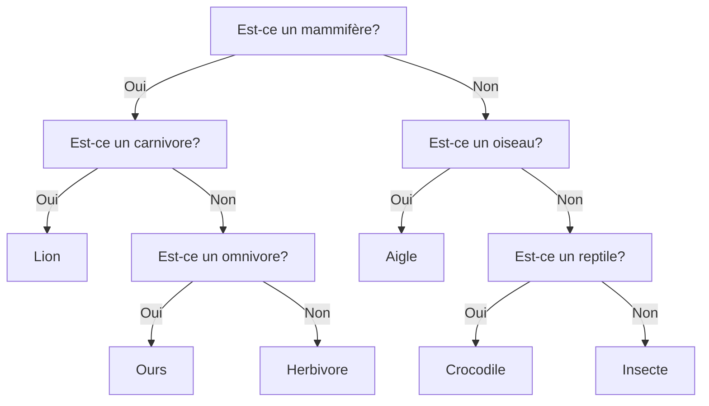
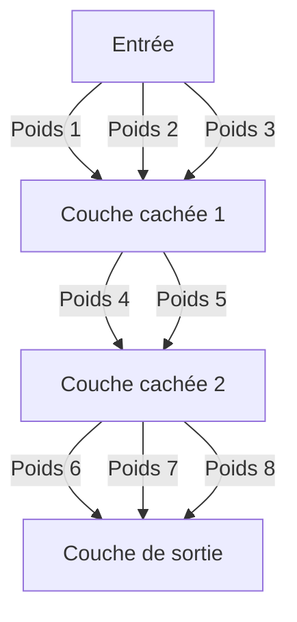

# Introduction

<iframe width="560" height="315" src="https://www.youtube.com/embed/ACWEAdi7wAo" title="YouTube video player" frameborder="0" allow="accelerometer; autoplay; clipboard-write; encrypted-media; gyroscope; picture-in-picture; web-share" allowfullscreen></iframe>

https://www.youtube.com/embed/ACWEAdi7wAo

<iframe width="560" height="315" src="https://www.youtube.com/embed/d4vfMgWG-Jw" title="YouTube video player" frameborder="0" allow="accelerometer; autoplay; clipboard-write; encrypted-media; gyroscope; picture-in-picture; web-share" allowfullscreen></iframe>

https://www.youtube.com/embed/d4vfMgWG-Jw

# Régression

## Régression linéaire simple et multiple

Commençons par l'un des modèles de Machine Learning les plus fondamentaux : la régression linéaire. La régression linéaire est une technique qui permet de modéliser la relation entre une variable dépendante (la variable que l'on souhaite prédire) et une ou plusieurs variables indépendantes (les variables qui sont utilisées pour prédire la variable dépendante).

### Régression linéaire simple

La régression linéaire simple est utilisée lorsque nous avons une seule variable indépendante et que nous cherchons à prédire une variable dépendante continue. Dans ce cas, nous cherchons à trouver la droite qui minimise la distance entre les points de données et cette droite. Nous utilisons ensuite cette droite pour prédire la valeur de la variable dépendante pour de nouvelles valeurs de la variable indépendante.

```python
# Ce code présente animation simple pour présenter la régression linéaire.
import numpy as np
import matplotlib.pyplot as plt
from matplotlib import style
from matplotlib.animation import FuncAnimation

style.use('fivethirtyeight')

fig = plt.figure()
ax1 = fig.add_subplot(1, 1, 1)

x = []
y = []

def create_pseudo_random_data(x):
    variation = np.random.randint(-6, 6)
    y = 2 * x + 1 + variation
    return y

def animate(i):
    # on place des points aléatoires mais continue en x
    previous_x = x[-1] if len(x) > 0 else 0
    x.append(previous_x + 1)
    y.append(create_pseudo_random_data(x[-1]))
    # on affiche les points (on ne relie pas les points)
    ax1.clear()
    ax1.scatter(x, y)
    if len(x) > 2:
        # on calcule la régression linéaire
        moyenne_x = np.mean(x)
        moyenne_y = np.mean(y)
        moyenne_x_carre = np.mean([x_i * x_i for x_i in x])
        moyenne_xy = np.mean([x_i * y_i for x_i, y_i in zip(x, y)])
        # on calcule les coefficients de la droite
        a = (moyenne_xy - moyenne_x * moyenne_y) / (moyenne_x_carre - moyenne_x * moyenne_x)
        b = moyenne_y - a * moyenne_x
        print('a =', a, 'b =', b)
        # on affiche la droite
        x_min = min(x)
        x_max = max(x)
        y_min = a * x_min + b
        y_max = a * x_max + b
        ax1.plot([x_min, x_max], [y_min, y_max], color='red')

ani = FuncAnimation(fig, animate, interval=1000)
plt.show()
```


Ce code est un exemple simple d'animation pour présenter la régression linéaire. L'animation consiste en la création de points aléatoires, suivis de l'ajustement d'une droite de régression linéaire aux données.

Dans cette animation, nous avons une fonction nommée `create_pseudo_random_data(x)` qui prend en entrée une valeur de `x` et retourne une valeur de `y` générée aléatoirement en utilisant la relation `y = 2 * x + 1` avec une variation aléatoire.

La fonction `animate(i)` est appelée par `FuncAnimation` à chaque intervalle de temps défini (dans ce cas, toutes les 1000 millisecondes). À chaque appel de `animate(i)`, nous ajoutons un nouveau point de données à notre ensemble de données, puis nous recalculons la droite de régression linéaire en utilisant tous les points de données.

Si l'ensemble de données contient plus de deux points, nous pouvons calculer les coefficients `a` et `b` de la droite de régression linéaire en utilisant les formules mathématiques de la régression linéaire simple. Pour rappel, l'équation de la droite de régression linéaire est de la forme :
$$
y = a x + b
$$

$$
a =\frac{\overline{xy} - \overline{x} \cdot \overline{y}}{\overline{x^2} - \overline{x}^2} \
$$

$$
b = \overline{y} - a \cdot \overline{x}
$$

Nous utilisons ensuite ces coefficients pour tracer la droite de régression linéaire en rouge sur le graphique.

Cette animation montre comment la régression linéaire peut être utilisée pour modéliser une relation entre deux variables et comment la droite de régression linéaire peut être ajustée aux données pour fournir des prévisions pour de nouvelles valeurs de `x`. Nous verrons plus en détail comment entraîner et évaluer des modèles de régression linéaire simple et multiple dans les sections suivantes de ce cours.

En Python, on peut utiliser la librairie `scikit-learn` pour appliquer une régression linéaire simple sur des données. `scikit-learn` est une librairie open-source largement utilisée pour des tâches de machine learning, y compris la régression linéaire.

Voici un exemple de code utilisant `scikit-learn` pour effectuer une régression linéaire simple :

```python
from sklearn.linear_model import LinearRegression
import numpy as np
import matplotlib.pyplot as plt

# Données d'exemple : x et y sont deux vecteurs numpy de même taille
x = np.array([1, 2, 3, 4, 5])
y = np.array([2.1, 4.2, 6.1, 8.0, 10.1])

# Création d'un objet LinearRegression
model = LinearRegression()

# Apprentissage sur les données
model.fit(x.reshape(-1, 1), y)

# Prédiction pour une nouvelle valeur de x
new_x = np.array([6])
predicted_y = model.predict(new_x.reshape(-1, 1))

# Affichage des coefficients de la droite de régression
print('Coefficients : a =', model.coef_[0], ' b =', model.intercept_)

# Affichage de la prédiction pour la nouvelle valeur de x
print('Prediction for x =', new_x[0], ' : y =', predicted_y[0])

# Affichage des données et de la droite de régression
plt.scatter(x, y)
plt.plot([min(x), max(x)], [model.predict([[min(x)]])[0], model.predict([[max(x)]])[0]], color='red')
# on place la prédiction en violet
plt.scatter(new_x, predicted_y, color='purple')
plt.show()
```


Dans cet exemple, nous importons la classe `LinearRegression` de `scikit-learn`, et nous utilisons cette classe pour créer un objet `model`. Nous entraînons ensuite ce modèle sur les données `x` et `y` à l'aide de la méthode `fit`, et nous pouvons utiliser la méthode `predict` pour effectuer des prédictions sur de nouvelles données.

La méthode `fit` calcule les coefficients de la droite de régression linéaire, qui sont accessibles via les attributs `coef_` et `intercept_` de l'objet `model`. Dans cet exemple, nous utilisons également la fonction `reshape` de `numpy` pour transformer les vecteurs `x` et `new_x` en matrices de taille (n, 1), nécessaires pour utiliser la méthode `fit` et la méthode `predict`.

### Régression linéaire multiple

La régression linéaire multiple est utilisée lorsque nous avons plusieurs variables indépendantes et que nous cherchons à prédire une variable dépendante continue. Dans ce cas, nous cherchons à trouver un plan (ou une hyperplan dans les cas de dimensions supérieures) qui minimise la distance entre les points de données et ce plan. Nous utilisons ensuite ce plan pour prédire la valeur de la variable dépendante pour de nouvelles valeurs des variables indépendantes.

```python
import numpy as np
import matplotlib.pyplot as plt
from matplotlib.animation import FuncAnimation
from mpl_toolkits.mplot3d import Axes3D
from matplotlib import style

style.use('ggplot')

fig = plt.figure()
ax1 = fig.add_subplot(111, projection='3d')

x1 = []
x2 = []
y = []


def create_pseudo_random_data(x1, x2):
    variation = np.random.randint(-15, 15)
    y = 2 * x1 + - 3 * x2 + 1 + variation
    return y


def animate(i):
    previous_x1 = x1[-1] if len(x1) > 0 else 0
    previous_x2 = x2[-1] if len(x2) > 0 else 0
    x1.append(previous_x1 + np.random.randint(-15, 15))
    x2.append(previous_x2 + np.random.randint(-15, 15))
    y.append(create_pseudo_random_data(x1[-1], x2[-1]))

    ax1.clear()
    ax1.scatter(x1, x2, y)

    if len(x1) > 2:
        X = np.column_stack((np.array(x1), np.array(x2), np.ones(len(x1))))
        Y = np.array(y)
        beta = np.linalg.inv(X.T @ X) @ X.T @ Y

        # on affiche l'équation du plan
        print('y =', beta[0], '* x1 +', beta[1], '* x2 +', beta[2])

        x1_min, x1_max = min(x1), max(x1)
        x2_min, x2_max = min(x2), max(x2)
        x1_range = np.linspace(x1_min, x1_max)
        x2_range = np.linspace(x2_min, x2_max)
        X1, X2 = np.meshgrid(x1_range, x2_range)
        Y_pred = beta[0] * X1 + beta[1] * X2 + beta[2]
        ax1.plot_surface(X1, X2, Y_pred, color='r', alpha=0.3)

    ax1.set_xlabel('X1')
    ax1.set_ylabel('X2')
    ax1.set_zlabel('Y')


ani = FuncAnimation(fig, animate, interval=1000)
plt.show()
```


Ce code réalise une animation pour la régression linéaire multiple, où les données sont distribuées dans l'espace et suivent l'équation d'un plan. Plus précisément, il crée une figure avec une projection en 3D, où des points sont ajoutés progressivement à la figure en suivant une fonction définie, `create_pseudo_random_data(x1, x2)`, qui génère des données pseudo-aléatoires selon l'équation d'un plan avec deux variables explicatives `x1` et `x2`.

A chaque itération de la boucle d'animation, le code ajoute un nouveau point de données en calculant les valeurs de `x1` et `x2` à partir des valeurs précédentes et d'un ajout pseudo-aléatoire. Ensuite, il calcule la régression linéaire multiple à l'aide de la méthode des moindres carrés, à partir de toutes les données précédemment ajoutées, et affiche l'équation du plan ainsi que sa représentation graphique dans l'espace.

Le résultat final est une animation qui montre l'évolution du plan de régression linéaire multiple à mesure que de nouvelles données sont ajoutées. La projection en 3D permet de visualiser les relations entre les variables explicatives et la variable cible.

La régression linéaire multiple est une extension de la régression linéaire simple. Alors que la régression linéaire simple utilise une seule variable indépendante (une variable d'entrée) pour prédire la variable dépendante (la variable de sortie), la régression linéaire multiple utilise plusieurs variables indépendantes pour faire la prédiction. Par exemple, si nous voulons prédire le prix d'une maison, nous pourrions utiliser des variables telles que la surface de la maison, le nombre de chambres, l'âge de la maison, le quartier, etc. pour faire notre prédiction.

La forme générale de la régression linéaire multiple est la suivante : 
$$
y = \beta_0 + \beta_1 x + \beta_2 x2 + \beta_3 x3 + ... + \beta_n xn + \epsilon
$$
où :

- y est la variable dépendante (la variable de sortie) que nous voulons prédire.
- `x1, x2, ..., xn` sont les variables indépendantes (les variables d'entrée) que nous utilisons pour prédire y.
- `b0, b1, b2, ..., bn` sont les coefficients de la régression, qui sont les valeurs que nous voulons trouver pour ajuster notre modèle de sorte qu'il puisse faire des prédictions précises.
- `e` est l'erreur résiduelle, c'est-à-dire la différence entre la valeur prédite de y et sa valeur réelle. Notre objectif est de minimiser cette erreur résiduelle.

Pour trouver les coefficients de la régression (b0, b1, b2, ..., bn), nous utilisons une technique appelée la méthode des moindres carrés. Cette méthode consiste à trouver les valeurs des coefficients qui minimisent la somme des carrés des écarts entre les valeurs prédites et les valeurs réelles. En d'autres termes, nous ajustons les coefficients pour minimiser la différence entre les valeurs prédites et les valeurs réelles.

Voici un exemple de code utilisant `scikit-learn` pour effectuer une régression linéaire multiple :

```python
from sklearn.linear_model import LinearRegression
import numpy as np
import matplotlib.pyplot as plt
from mpl_toolkits.mplot3d import Axes3D

# Données d'exemple : X est une matrice de taille (n, p) et y est un vecteur de taille n
# on préfère des données distribuées de façon aléatoire sur un plan 3D
X0 = [np.random.randint(0, 10) for _ in range(10)]
X1 = [X0[i] + np.random.randint(-10, 10) for i in range(10)]
X = np.array([[x0, x1] for x0, x1 in zip(X0, X1)])
y = [x0 + x1 + np.random.randint(0, 5) for x0, x1 in zip(X0, X1)]

# Création d'un objet LinearRegression
model = LinearRegression()

# Apprentissage sur les données
model.fit(X, y)

# Prédiction pour de nouvelles valeurs de X
new_X = np.array([[2, 3], [5, 6], [8, 9]])
predicted_y = model.predict(new_X)

# Affichage des coefficients de la droite de régression
print('Coefficients :', model.coef_)
print('Intercept :', model.intercept_)

# Affichage des prédictions pour les nouvelles valeurs de X
for i in range(len(new_X)):
    print('Prediction for X =', new_X[i], ' : y =', predicted_y[i])

# Affichage du graphe 3D (la prédiction est en violet)
fig = plt.figure()
ax = fig.add_subplot(111, projection='3d')

# Tracé des points de données en rouge
ax.scatter(X[:, 0], X[:, 1], y, color='red')

# Tracé des prédictions en violet
ax.scatter(new_X[:, 0], new_X[:, 1], predicted_y, color='purple')

# Création d'une grille de points pour le plan de régression
xx, yy = np.meshgrid(range(10), range(12))
zz = model.coef_[0] * xx + model.coef_[1] * yy + model.intercept_

# Tracé du plan de régression en vert
ax.plot_surface(xx, yy, zz, alpha=0.2, color='green')

ax.set_xlabel('X1')
ax.set_ylabel('X2')
ax.set_zlabel('y')
plt.show()
```


Ce code présente un exemple d'application de la régression linéaire avec deux variables d'entrée. Voici les différentes étapes du code :

1. Génération de données aléatoires : la variable X est une matrice de taille (n, p) avec n = 10 et p = 2. Les valeurs de X sont choisies aléatoirement en utilisant la fonction np.random.randint. La variable y est un vecteur de taille n, calculé à partir des valeurs de X avec un bruit aléatoire.
2. Création d'un objet `LinearRegression` : la classe `LinearRegression`est importée depuis la bibliothèque scikit-learn. Un objet `LinearRegression`est créé en utilisant le constructeur par défaut.
3. Apprentissage sur les données : la méthode **fit()** de l'objet `LinearRegression`est appelée en passant les données d'entrée X et la variable cible y. Cela permet d'ajuster les coefficients de la droite de régression en utilisant la méthode des moindres carrés.
4. Prédiction : la méthode **predict()** de l'objet `LinearRegression`est appelée en passant de nouvelles valeurs de X. Cela permet de prédire les valeurs de la variable cible pour ces nouvelles valeurs de X.
5. Affichage des résultats : les coefficients de la droite de régression et l'ordonnée à l'origine sont affichés. Les prédictions pour les nouvelles valeurs de X sont également affichées. Enfin, les points de données sont affichés en rouge, les prédictions en violet et le plan de régression en vert.

La fonction scatter() de matplotlib est utilisée pour tracer les points en 3D. La fonction plot_surface() est utilisée pour tracer le plan de régression. La classe Axes3D de mpl_toolkits.mplot3d est utilisée pour gérer l'affichage en 3D.

### Modification de la fonction objectif

#### Lasso

Le Lasso (Least Absolute Shrinkage and Selection Operator) est une technique de régression linéaire régularisée qui peut être utilisée pour la sélection de variables et la réduction de dimension. Il est souvent utilisé en apprentissage automatique pour la sélection de caractéristiques dans des modèles de régression linéaire.

Le principe du Lasso est de pénaliser la magnitude des coefficients de régression. Il introduit une contrainte sur la somme des valeurs absolues des coefficients, appelée pénalité L1. Cette pénalité a pour effet de réduire les coefficients les moins importants à zéro, ce qui équivaut à supprimer les variables correspondantes de l'ensemble de caractéristiques. Cela permet de sélectionner les caractéristiques les plus importantes tout en réduisant le surajustement (overfitting) du modèle.

Mathématiquement, la fonction de coût du Lasso est définie comme suit :
$$
\min_{w} |y - Xw|^2 + \alpha|w|_{1}
$$
où `y` est le vecteur des variables cibles, `X` est la matrice des caractéristiques, `w` est le vecteur des coefficients de régression, `alpha` est le paramètre de régularisation qui contrôle le niveau de pénalité L1 et `||1` est la norme L1 des coefficients.

Le paramètre de régularisation `alpha` peut être ajusté pour contrôler l'importance de la pénalité L1. Une valeur plus élevée de `alpha` correspond à une pénalité plus forte et donc à une réduction plus importante des coefficients.

Scikit-Learn propose une implémentation du Lasso via la classe `Lasso` du module `linear_model`. Voici un exemple d'utilisation :

```python
from sklearn.linear_model import Lasso

# X et y sont les données d'entraînement
lasso = Lasso(alpha=0.1)
lasso.fit(X, y)
```

Notez que le choix du paramètre de régularisation `alpha` est important pour obtenir un modèle précis et bien ajusté. Il peut être ajusté en utilisant une recherche de grille ou une validation croisée.

Le Lasso est une méthode très utile pour la sélection de caractéristiques et la réduction de dimension, en particulier pour les problèmes avec un grand nombre de caractéristiques. Cependant, il peut ne pas fonctionner aussi bien si les variables indépendantes sont fortement corrélées, car il a tendance à sélectionner arbitrairement une seule variable à partir d'un groupe de variables hautement corrélées. Dans ce cas, une méthode de régularisation différente comme la régression Ridge peut être plus appropriée.

#### Ridge

Ridge est une technique de régularisation utilisée en régression linéaire pour limiter les coefficients du modèle en ajoutant une pénalité L2 à la fonction de coût. Comme avec Lasso, cette technique de régularisation vise à réduire l'overfitting en ajoutant un biais au modèle qui décourage les coefficients de prendre des valeurs trop grandes.

En utilisant Ridge, la fonction de coût utilisée pour ajuster le modèle est :
$$
J(\theta) = \sum_{i=1}^{m}(h_\theta(x^{(i)})-y^{(i)})^2 + \lambda\sum_{j=1}^{n}\theta_j^2
$$
où **θ** représente les coefficients du modèle, **λ** est le paramètre de régularisation (également appelé hyperparamètre) qui contrôle la force de la régularisation, et **n** est le nombre de caractéristiques dans les données. La deuxième partie de la fonction de coût est une somme des carrés des coefficients pondérée par **λ**, qui pousse les coefficients vers des valeurs plus petites. Plus **λ** est grand, plus les coefficients sont pénalisés et plus le modèle est régularisé.

Pour ajuster un modèle de régression linéaire avec Ridge en utilisant Scikit-Learn, on utilise la classe `Ridge` et on spécifie la valeur de **λ** en utilisant le paramètre `alpha`. Voici un exemple de code :

```python
from sklearn.linear_model import Ridge
import numpy as np

# Création d'un objet Ridge avec une régularisation de 0.1
ridge = Ridge(alpha=0.1)

# Entraînement du modèle sur les données d'entraînement
ridge.fit(X, y)
```

Comme avec Lasso, le choix de la valeur de **λ** peut être important pour la performance du modèle. Des valeurs plus élevées de **λ** peuvent conduire à des coefficients plus petits, mais une régularisation trop forte peut conduire à une sous-ajustement. La valeur de **λ** doit être ajustée en utilisant des techniques de validation croisée pour trouver la valeur optimale pour un ensemble de données particulier.

#### Elastic net

Elastic Net est une méthode de régularisation pour les modèles linéaires, combinant à la fois la pénalisation L1 (Lasso) et L2 (Ridge). Elle permet de gérer les cas où il y a des corrélations élevées entre les variables prédictives, en utilisant L1 pour sélectionner des variables importantes et L2 pour donner des poids aux variables sélectionnées. Elastic Net aide ainsi à éviter certains des problèmes liés à Lasso, tels que la sélection excessive de variables dans des cas de colinéarité, tout en réduisant les coefficients de variables moins importantes à zéro.

## Régression polynomiale

La régression polynomiale est une extension de la régression linéaire qui permet de modéliser des relations non linéaires entre les variables indépendantes et dépendantes. Dans la régression polynomiale, on utilise des polynômes comme fonction d'hypothèse au lieu d'une fonction linéaire.

La régression polynomiale est particulièrement utile lorsque les données ont une relation non linéaire, mais que cette relation peut encore être approximée par une fonction polynomiale.

La forme générale de la régression polynomiale d'ordre `n` est la suivante :
$$
y = \beta_0 + \beta_1 x + \beta_2 x^2 + \beta_3 x^3 + ... + \beta_n x^n + \epsilon
$$


où `y` est la variable dépendante, `x` est la variable indépendante, `beta_0` à `beta_n` sont les coefficients du modèle, et `epsilon` est l'erreur résiduelle.

Pour ajuster une régression polynomiale à des données, nous utilisons une méthode similaire à celle de la régression linéaire. Nous choisissons une fonction d'hypothèse, calculons les coefficients qui minimisent l'erreur résiduelle, puis utilisons cette fonction pour prédire les valeurs de `y` pour de nouvelles valeurs de `x`.

Dans Python, nous pouvons ajuster une régression polynomiale en utilisant la classe `PolynomialFeatures` du module `sklearn.preprocessing`. Cette classe transforme les données d'entrée en un ensemble de caractéristiques polynomiales, qui peuvent ensuite être ajustées à un modèle de régression linéaire.

Voici un exemple animé de régression polynomiale en Python avec Matplotlib :

```python
import numpy as np
import matplotlib.pyplot as plt
from matplotlib.animation import FuncAnimation

fig, ax = plt.subplots()

x = []
y = []


def create_pseudo_random_data(x):
    variation = np.random.randint(-50, 50)
    y = 0.3 * x ** 2 + 2 * x + 3 + variation
    return y


def animate(i):
    previous_x = x[-1] if len(x) > 0 else 0
    x.append(previous_x + np.random.randint(-10, 10))
    y.append(create_pseudo_random_data(x[-1]))

    ax.clear()
    ax.scatter(x, y)

    if len(x) > 2:
        # Régression polynomiale d'ordre 2
        coeffs = np.polyfit(x, y, 2)
        poly = np.poly1d(coeffs)
        x_range = np.linspace(min(x), max(x), 100)
        y_range = poly(x_range)
        ax.plot(x_range, y_range, color='r')

    ax.set_xlabel('X')
    ax.set_ylabel('Y')


ani = FuncAnimation(fig, animate, interval=500)
plt.show()
```


Dans cet exemple, nous générons des données pseudo-aléatoires qui suivent une équation polynomiale du second degré. À chaque itération de l'animation, nous ajoutons un nouveau point aux données et effectuons une régression polynomiale d'ordre 2 en utilisant la fonction `np.polyfit()`. Nous générons ensuite une plage de valeurs `x_range` pour afficher la courbe de régression.

Le résultat est une animation qui montre comment la courbe de régression évolue à mesure que de nouvelles données sont ajoutées.


Voici un exemple de code utilisant `scikit-learn` pour effectuer une régression linéaire polynomiale sur des données :

```python
from sklearn.preprocessing import PolynomialFeatures
from sklearn.linear_model import LinearRegression
import numpy as np
import matplotlib.pyplot as plt

# Données d'exemple : x et y sont deux vecteurs numpy de même taille
x = np.array([1, 2, 3, 4, 5])
y = np.array([2.1, 5.5, 10.1, 17.5, 26.9])

# Création d'un objet PolynomialFeatures pour générer la variable polynomiale
poly = PolynomialFeatures(degree=2)

# Génération des variables polynomiales pour les données x
x_poly = poly.fit_transform(x.reshape(-1, 1))

# Création d'un objet LinearRegression
model = LinearRegression()

# Apprentissage sur les données
model.fit(x_poly, y)

# Prédiction pour une nouvelle valeur de x
new_x = np.array([6])
new_x_poly = poly.transform(new_x.reshape(-1, 1))
predicted_y = model.predict(new_x_poly)

# Affichage des coefficients de la droite de régression polynomiale
print('Coefficients : a =', model.coef_[2], ' b =', model.coef_[1], ' c =', model.intercept_)

# Affichage de la prédiction pour la nouvelle valeur de x
print('Prediction for x =', new_x[0], ' : y =', predicted_y[0])

# Affichage des données et de la droite de régression polynomiale
plt.scatter(x, y)
# Affiche la prédiction pour la nouvelle valeur de x
plt.scatter(new_x, predicted_y, color='purple')
plt.show()
```


Ce code illustre l'utilisation de la régression polynomiale pour ajuster un modèle linéaire aux données d'entrée. Voici les différentes étapes du code :

1. Importation des bibliothèques nécessaires : `numpy`, `matplotlib`, `PolynomialFeatures` et `LinearRegression` depuis `sklearn.preprocessing` et `sklearn.linear_model` respectivement.
2. Définition des données d'exemple `x` et `y`, qui sont deux vecteurs numpy de même taille. Dans cet exemple, nous avons une variable d'entrée `x` et une variable cible `y`.
3. Création d'un objet `PolynomialFeatures` avec un degré de 2. Cet objet permet de générer des variables polynomiales pour les données d'entrée.
4. Génération des variables polynomiales pour les données d'entrée `x` en utilisant la méthode `fit_transform` de l'objet `PolynomialFeatures`. Cette méthode retourne une nouvelle matrice de données `x_poly` qui contient les variables polynomiales ainsi que la constante.
5. Création d'un objet `LinearRegression`.
6. Apprentissage du modèle sur les données en utilisant la méthode `fit` de l'objet `LinearRegression`. Cette méthode ajuste le modèle linéaire aux données d'entrée.
7. Prédiction pour une nouvelle valeur de `x` en utilisant la méthode `predict` de l'objet `LinearRegression`. Cette méthode prend en entrée une nouvelle valeur de `x` et retourne la prédiction de la variable cible `y`.
8. Affichage des coefficients de la droite de régression polynomiale obtenue par le modèle en utilisant les attributs `coef_` et `intercept_` de l'objet `LinearRegression`.
9. Affichage de la prédiction pour la nouvelle valeur de `x`.
10. Affichage des données et de la droite de régression polynomiale à l'aide de la fonction `scatter` de matplotlib. La prédiction pour la nouvelle valeur de `x` est également affichée en violet.

En résumé, ce code illustre comment utiliser la régression polynomiale pour ajuster un modèle linéaire aux données d'entrée en utilisant les objets `PolynomialFeatures` et `LinearRegression` de la bibliothèque `scikit-learn`.

## Régression logistique

La régression logistique est un modèle de classification binaire qui permet de prédire la probabilité d'appartenance d'un exemple à une classe donnée. Contrairement à la régression linéaire, qui prédit des valeurs continues, la régression logistique est utilisée pour prédire des probabilités comprises entre 0 et 1.

La théorie derrière la régression logistique est basée sur la fonction logistique, également appelée fonction sigmoïde. La fonction logistique prend en entrée une variable continue et renvoie une valeur comprise entre 0 et 1, qui peut être interprétée comme une probabilité. La fonction logistique est définie comme suit :
$$
f(x) = \frac{1}{1 + e^{-x}}
$$


La régression logistique utilise la fonction logistique pour modéliser la relation entre une variable continue et une variable binaire. Elle est souvent utilisée pour prédire des variables binaires telles que "oui" ou "non", "vrai" ou "faux", "1" ou "0", etc.

Il existe plusieurs types de régression logistique, notamment la régression logistique binaire, qui prédit deux classes, et la régression logistique multinomiale, qui prédit plusieurs classes.

La régression logistique est souvent utilisée pour analyser les relations entre une variable binaire et une ou plusieurs variables explicatives continues ou catégorielles. Elle peut être utilisée pour prédire la probabilité de succès ou d'échec dans des situations telles que la prédiction de la survie d'un patient après une intervention chirurgicale, la prédiction de la probabilité de défaut de paiement d'un prêt bancaire, la prédiction de la probabilité de conversion d'un prospect en client, etc.

Pour entraîner un modèle de régression logistique, nous utilisons la méthode de maximisation de la vraisemblance, qui consiste à ajuster les paramètres du modèle pour maximiser la probabilité de voir les données observées. Nous utilisons ensuite une fonction de seuil pour convertir les probabilités prédites en valeurs binaires.

```python
import numpy as np
import matplotlib.pyplot as plt
from matplotlib.animation import FuncAnimation
from matplotlib import style

style.use('ggplot')

fig = plt.figure()
ax1 = fig.add_subplot(111, projection='3d')

x1 = []
x2 = []
y = []
colors = []


def sigmoid(x):
    return 1 / (1 + np.exp(-x))


def create_pseudo_random_data():
    b0, b1, b2 = 1, 2, -3
    x1 = np.random.randint(-10, 10)
    x2 = np.random.randint(-10, 10)
    z = b0 + b1 * x1 + b2 * x2 + np.random.randn() * 2
    y = sigmoid(z)
    if y > 0.5:
        color = 'r'
    else:
        color = 'b'
    return x1, x2, y, color


def stochastic_gradient_descent(X, Y, alpha, max_epochs):
    b = np.zeros(X.shape[1])
    for epoch in range(max_epochs):
        for i in range(X.shape[0]):
            y_pred = sigmoid(X[i] @ b)
            error = Y[i] - y_pred
            b += alpha * error * X[i]
    return b


def animate(i):
    for j in range(2):
        x1_i, x2_i, y_i, color_i = create_pseudo_random_data()
        x1.append(x1_i)
        x2.append(x2_i)
        y.append(y_i)
        colors.append(color_i)

    if len(x1) > 2:
        X = np.column_stack((np.array(x1), np.array(x2), np.ones(len(x1))))
        Y = np.array(y)

        b = stochastic_gradient_descent(X, Y, alpha=0.01, max_epochs=1000)

        # on affiche l'équation du plan
        print('y = 1 / (1 + exp(-(', -b[0], '* x1 +', -b[1], '* x2 +', -b[2], ')))')

        x1_min, x1_max = min(x1), max(x1)
        x2_min, x2_max = min(x2), max(x2)
        xx, yy = np.meshgrid(np.linspace(x1_min, x1_max, 100), np.linspace(x2_min, x2_max, 100))
        X_grid = np.column_stack((xx.ravel(), yy.ravel(), np.ones(len(xx.ravel()))))
        y_pred = sigmoid(X_grid @ -b)
        Z = y_pred.reshape(xx.shape)
        # on efface la figure précédente
        ax1.clear()
        # on affiche la surface
        ax1.plot_surface(xx, yy, Z, cmap='coolwarm', alpha=0.3)
        # on affiche les points
        for x1_i, x2_i, y_i, color_i in zip(x1, x2, y, colors):
            ax1.scatter(x1_i, x2_i, y_i, c=color_i)

    ax1.set_xlabel('X1')
    ax1.set_ylabel('X2')
    ax1.set_zlabel('Y')


ani = FuncAnimation(fig, animate, interval=1000)
plt.show()
```


Ce code illustre la régression logistique à l'aide d'un exemple de données générées de manière pseudo-aléatoire.

Le code commence par importer les bibliothèques nécessaires, notamment `numpy` pour les calculs, `matplotlib` pour les graphiques et la bibliothèque d'animation pour animer la visualisation.

Le code définit ensuite une fonction nommé `sigmoid` qui calcule la fonction sigmoïde pour une valeur donnée. La fonction sigmoïde sera utilisée pour convertir les résultats de la régression linéaire en une probabilité.

La fonction `create_pseudo_random_data` est utilisée pour générer des données de manière pseudo-aléatoire. Elle génère deux variables continues x1 et x2, calcule une variable z en fonction des coefficients b0, b1 et b2 et ajoute un peu de bruit. Elle calcule ensuite une probabilité en appliquant la fonction `sigmoid` à z, et assigne une couleur **bleu** si la probabilité est supérieure à 0,5 et **rouge** sinon.

La fonction `stochastic_gradient_descent` est utilisée pour entraîner le modèle de régression logistique. Elle utilise l'algorithme de descente de gradient stochastique pour ajuster les coefficients b afin de minimiser l'erreur entre les probabilités prédites et les probabilités réelles.

La fonction `animate` est utilisée pour animer la visualisation des données. Elle génère des données de manière pseudo-aléatoire en utilisant la fonction `create_pseudo_random_data`, puis entraîne un modèle de régression logistique à l'aide de la fonction `stochastic_gradient_descent`. Elle utilise ensuite les coefficients b pour tracer la surface qui correspond à la fonction sigmoïde calculée pour toutes les combinaisons possibles de x1 et x2.

Enfin, la fonction `animate` affiche les points de données générés de manière pseudo-aléatoire et la surface de la fonction sigmoïde sur un graphique 3D.


Voici un exemple d'utilisation de Scikit-Learn pour la régression logistique :

Supposons que nous avons des données sur le poids et la taille de différents animaux, et que nous voulons prédire si un animal est un chat ou un chien en fonction de sa taille et de son poids. Nous pouvons utiliser la régression logistique pour modéliser cette relation.

Nous commençons par importer les modules nécessaires et créer des données d'exemple :

```python
import numpy as np
import matplotlib.pyplot as plt
from sklearn.linear_model import LogisticRegression

# Poids et taille des chats
X_cats = np.array([[2, 25], [3, 30], [4, 35], [5, 40], [6, 45], [7, 50], [8, 55], [9, 60], [10, 65], [11, 70]])
y_cats = np.zeros(len(X_cats))

# Poids et taille des chiens
X_dogs = np.array([[10, 60], [12, 65], [14, 70], [16, 75], [18, 80], [20, 85], [22, 90], [24, 95], [26, 100], [28, 105]])
y_dogs = np.ones(len(X_dogs))

# On combine les données d'entrée et les étiquettes pour former un ensemble de données complet
X = np.concatenate((X_cats, X_dogs))
y = np.concatenate((y_cats, y_dogs))

# Création du modèle de régression logistique
clf = LogisticRegression()

# Entraînement du modèle sur les données d'entraînement
clf.fit(X, y)

# Prédiction de l'espèce pour un animal de 5 kg et 10 cm
new_animal = np.array([[7, 55]])
prediction = clf.predict(new_animal)
print(prediction)

# On affiche sur un graphique les données d'entraînement et la prédiction
plt.scatter(X_cats[:, 0], X_cats[:, 1], color='red', label='Cat')
plt.scatter(X_dogs[:, 0], X_dogs[:, 1], color='blue', label='Dog')
plt.scatter(new_animal[:, 0], new_animal[:, 1], color='purple', label='New animal')
# On récupère la droite de séparation
w = clf.coef_[0]
a = -w[0] / w[1]
xx = np.linspace(0, 30)
yy = a * xx - (clf.intercept_[0]) / w[1]
plt.plot(xx, yy, 'k-')
plt.legend()
plt.show()
```


Ce code montre comment utiliser Scikit-Learn pour entraîner un modèle de régression logistique binaire sur un ensemble de données d'animaux. Les données d'entrée sont le poids et la taille de chaque animal, et l'étiquette de classe est soit 0 pour un chat, soit 1 pour un chien.

Tout d'abord, nous définissons les données d'entrée pour les chats et les chiens et les étiquettes de classe correspondantes. Ensuite, nous combinons les données d'entrée et les étiquettes pour former un ensemble de données complet.

Nous créons ensuite un modèle de régression logistique en utilisant la classe LogisticRegression de Scikit-Learn et entraînons le modèle sur l'ensemble de données d'entraînement en utilisant la méthode fit().

Nous utilisons ensuite le modèle entraîné pour prédire l'espèce pour un nouvel animal dont nous avons les caractéristiques de poids et de taille.

Enfin, nous affichons les données d'entraînement et la prédiction sur un graphique en utilisant la fonction scatter de Matplotlib. Nous traçons également la droite de séparation apprise par le modèle de régression logistique en utilisant les coefficients de la régression.

Ce code illustre donc comment utiliser Scikit-Learn pour entraîner un modèle de régression logistique binaire et comment utiliser Matplotlib pour visualiser les données et la prédiction.

## Dualité biais variance, l'overfitting et l'underfitting

Lorsque nous construisons des modèles d'apprentissage automatique, notre objectif est de produire des modèles qui sont capables de généraliser à de nouveaux ensembles de données. Cependant, nous sommes souvent confrontés à un dilemme entre la complexité du modèle et sa capacité à généraliser.

Le compromis entre la complexité et la capacité de généralisation est appelé la dualité biais/variance. Le biais fait référence à l'erreur due à une approximation inexacte des relations entre les caractéristiques et les étiquettes de sortie, tandis que la variance fait référence à l'erreur due à la sensibilité du modèle aux fluctuations aléatoires dans l'ensemble de données.

Si le modèle est trop simple, il peut sous-apprendre les relations entre les caractéristiques et les étiquettes de sortie, ce qui conduit à une erreur de biais élevée. Cela se produit lorsque le modèle est incapable de capturer la complexité sous-jacente des données.

D'autre part, si le modèle est trop complexe, il peut sur-apprendre les relations entre les caractéristiques et les étiquettes de sortie, ce qui conduit à une erreur de variance élevée. Cela se produit lorsque le modèle est trop ajusté aux données d'entraînement spécifiques et n'est pas capable de généraliser à de nouveaux ensembles de données.

L'overfitting et l'underfitting sont des phénomènes qui illustrent la dualité biais/variance. L'underfitting se produit lorsque le modèle est trop simple et ne parvient pas à capturer la complexité sous-jacente des données. Dans ce cas, le modèle a une erreur de biais élevée et une erreur de variance faible. L'overfitting se produit lorsque le modèle est trop complexe et est trop ajusté aux données d'entraînement spécifiques. Dans ce cas, le modèle a une erreur de variance élevée et une erreur de biais faible.

Pour résoudre le dilemme de la dualité biais/variance et éviter l'overfitting et l'underfitting, il est important de sélectionner un modèle approprié avec une complexité appropriée pour les données, de choisir des ensembles de données de formation et de test représentatifs, de régulariser le modèle et d'utiliser des techniques de validation croisée pour estimer la performance du modèle.

En résumé, la dualité biais/variance est un compromis entre la complexité et la capacité de généralisation d'un modèle. L'underfitting et l'overfitting sont des phénomènes qui illustrent la dualité biais/variance. Pour éviter l'overfitting et l'underfitting, il est important de sélectionner un modèle approprié avec une complexité appropriée pour les données, de choisir des ensembles de données de formation et de test représentatifs, de régulariser le modèle et d'utiliser des techniques de validation croisée pour estimer la performance du modèle.

<iframe width="560" height="315" src="https://www.youtube.com/embed/1lrofY8E1NU" title="YouTube video player" frameborder="0" allow="accelerometer; autoplay; clipboard-write; encrypted-media; gyroscope; picture-in-picture; web-share" allowfullscreen></iframe>

https://www.youtube.com/embed/1lrofY8E1NU

<iframe width="560" height="315" src="https://www.youtube.com/embed/Jeyb9BbKtpE" title="YouTube video player" frameborder="0" allow="accelerometer; autoplay; clipboard-write; encrypted-media; gyroscope; picture-in-picture; web-share" allowfullscreen></iframe>

https://www.youtube.com/embed/Jeyb9BbKtpE

## Évaluation de la performance des modèles de régression

Il existe plusieurs méthodes pour évaluer les performances des modèles de régression. Voici quelques-unes des méthodes les plus courantes, avec leurs avantages et leurs inconvénients :

1. Erreur quadratique moyenne (MSE) : la MSE est une mesure courante de l'erreur de prédiction d'un modèle de régression. Elle calcule la moyenne des carrés des écarts entre les valeurs prédites et les valeurs réelles. L'avantage de la MSE est qu'elle est facile à interpréter et à calculer. Son inconvénient est qu'elle peut être sensible aux valeurs aberrantes, ce qui peut fausser les résultats.
2. Coefficient de détermination (R²) : le coefficient de détermination est une mesure de la proportion de la variance expliquée par le modèle de régression. Il indique à quel point les valeurs prédites s'écartent des valeurs réelles. L'avantage de R² est qu'il est facile à interpréter et qu'il peut être utilisé pour comparer des modèles de régression différents. Son inconvénient est qu'il ne tient pas compte de la complexité du modèle et peut donc être trompeur si le modèle est trop complexe.
3. Validation croisée : la validation croisée est une technique qui consiste à diviser l'ensemble des données en ensembles d'entraînement et de test, puis à évaluer les performances du modèle sur l'ensemble de test. Cette technique est utile pour estimer la capacité de généralisation du modèle à de nouvelles données. L'avantage de la validation croisée est qu'elle est plus robuste que d'autres méthodes d'évaluation et qu'elle peut être utilisée pour tous les types de modèles de régression. Son inconvénient est qu'elle peut être plus lente que les autres méthodes et qu'elle peut nécessiter une grande quantité de données.
4. Erreur absolue moyenne (MAE) : la MAE est une mesure de l'erreur absolue de prédiction d'un modèle de régression. Elle calcule la moyenne des écarts absolus entre les valeurs prédites et les valeurs réelles. L'avantage de la MAE est qu'elle est moins sensible aux valeurs aberrantes que la MSE. Son inconvénient est qu'elle est moins interprétable que la MSE.
5. Erreur de prédiction moyenne absolue (MAPE) : le MAPE est une mesure de l'erreur relative de prédiction d'un modèle de régression. Il calcule la moyenne des écarts absolus entre les valeurs prédites et les valeurs réelles, normalisée par la valeur réelle. L'avantage du MAPE est qu'il est facile à interpréter et qu'il peut être utilisé pour comparer des modèles de régression différents. Son inconvénient est qu'il peut être sensible aux valeurs nulles ou proches de zéro.
6. Erreur de prédiction moyenne (MPE) : le MPE est une mesure de l'erreur relative de prédiction d'un modèle de régression. Il calcule la moyenne des écarts entre les valeurs prédites et les valeurs réelles, normalisée par la valeur réelle. L'avantage du MPE est qu'il est facile à interpréter et qu'il peut être utilisé pour comparer des modèles de régression différents. Son inconvénient est qu'il peut être sensible aux valeurs nulles ou proches de zéro.

Voici les méthodes de calcul et les formules pour les mesures d'évaluation de la régression que j'ai mentionnées précédemment :

1. Erreur quadratique moyenne (MSE) : La formule pour le calcul de la MSE est la suivante : MSE = (1/n) * ∑(yi - ŷi)² où yi est la valeur réelle, ŷi est la valeur prédite et n est le nombre d'observations.
2. Coefficient de détermination (R²) : La formule pour le calcul de R² est la suivante : R² = 1 - (SSres / SStot) où SSres est la somme des carrés des résidus (différences entre les valeurs réelles et prédites) et SStot est la somme des carrés totale (différence entre les valeurs réelles et leur moyenne).
3. Validation croisée : Il existe différentes méthodes de validation croisée, mais la plus courante est la validation croisée à k plis. Elle consiste à diviser l'ensemble de données en k ensembles de taille égale, puis à effectuer k fois une procédure d'entraînement et de test en utilisant chaque fois un ensemble différent comme ensemble de test. Les performances du modèle sont évaluées en moyenne sur les k ensembles de test.
4. Erreur absolue moyenne (MAE) : La formule pour le calcul de la MAE est la suivante : MAE = (1/n) * ∑|yi - ŷi| où yi est la valeur réelle, ŷi est la valeur prédite et n est le nombre d'observations.
5. Erreur de prédiction moyenne absolue (MAPE) : La formule pour le calcul de la MAPE est la suivante : MAPE = (1/n) * ∑(|(yi - ŷi)| / |yi|) où yi est la valeur réelle, ŷi est la valeur prédite et n est le nombre d'observations.
6. Erreur de prédiction moyenne (MPE) : La formule pour le calcul de la MPE est la suivante : MPE = (1/n) * ∑((yi - ŷi) / yi) où yi est la valeur réelle, ŷi est la valeur prédite et n est le nombre d'observations.

<iframe width="560" height="315" src="https://www.youtube.com/embed/ymRSxSY1nak" title="YouTube video player" frameborder="0" allow="accelerometer; autoplay; clipboard-write; encrypted-media; gyroscope; picture-in-picture; web-share" allowfullscreen></iframe>

https://www.youtube.com/embed/ymRSxSY1nak

## Vidéo récapitulative 

<iframe width="560" height="315" src="https://www.youtube.com/embed/Ee8gLwVCPxg" title="YouTube video player" frameborder="0" allow="accelerometer; autoplay; clipboard-write; encrypted-media; gyroscope; picture-in-picture; web-share" allowfullscreen></iframe>

https://www.youtube.com/embed/Ee8gLwVCPxg

# Classification :

## K-nearest neighbors (K-NN)

Le modèle K-NN est une méthode de classification non paramétrique qui est utilisée pour classifier des données en fonction de leur proximité avec les données d'entraînement. Le principe de base du modèle K-NN est de trouver les k points d'entraînement les plus proches d'un point de test donné, et de classer ce point en fonction de la classe majoritaire des k voisins les plus proches.

Le modèle K-NN peut être utilisé pour la classification binaire et multiclasse. Il est simple à comprendre et à implémenter, et il peut être utilisé pour des données numériques ou catégorielles.

Le choix de la valeur k est important dans le modèle K-NN. Une valeur k trop faible peut conduire à un surajustement (overfitting), tandis qu'une valeur k trop élevée peut conduire à un sous-ajustement (underfitting). Le choix de k dépendra de la taille de l'ensemble de données et de la complexité du problème de classification.

La distance euclidienne est généralement utilisée pour mesurer la proximité entre les points. Cependant, il est possible d'utiliser d'autres mesures de distance en fonction des caractéristiques de l'ensemble de données.

En résumé, les avantages du modèle K-NN sont sa simplicité et sa facilité d'interprétation, ainsi que sa capacité à fonctionner avec différents types de données. Cependant, ses inconvénients sont qu'il peut être sensible aux valeurs aberrantes, qu'il nécessite une grande quantité de données pour être précis et que sa performance peut être affectée par la valeur de k choisie.

Ci-dessous, un exemple de code Python pour implémenter un modèle K-NN avec la bibliothèque scikit-learn :

```python
from sklearn.neighbors import KNeighborsClassifier

# Créer un objet KNeighborsClassifier
knn = KNeighborsClassifier(n_neighbors=5)

# Entraîner le modèle sur les données d'entraînement
knn.fit(X_train, y_train)

# Faire des prédictions sur les données de test
y_pred = knn.predict(X_test)

# Calculer l'exactitude (accuracy) du modèle
accuracy = knn.score(X_test, y_test)
```

<iframe width="560" height="315" src="https://www.youtube.com/embed/2J9Y9yh7gd8" title="YouTube video player" frameborder="0" allow="accelerometer; autoplay; clipboard-write; encrypted-media; gyroscope; picture-in-picture; web-share" allowfullscreen></iframe>

https://www.youtube.com/embed/2J9Y9yh7gd8

## Arbre de décision

Les arbres de décision sont une méthode de classification qui consiste à diviser récursivement l'ensemble de données en sous-ensembles en fonction des caractéristiques qui sont les plus importantes pour la classification. Chaque division est effectuée de manière à minimiser l'impureté des sous-ensembles résultants.

Les arbres de décision sont faciles à comprendre et à interpréter, et ils peuvent être utilisés pour des données numériques ou catégorielles. Ils peuvent également être utilisés pour la classification binaire ou multiclasse.

L'un des avantages des arbres de décision est qu'ils peuvent gérer des données manquantes, en utilisant une stratégie de substitution pour remplacer les valeurs manquantes. Les arbres de décision peuvent également être utilisés pour sélectionner les caractéristiques les plus importantes pour la classification.

Cependant, les inconvénients des arbres de décision sont qu'ils peuvent être sensibles aux valeurs aberrantes, qu'ils peuvent être affectés par le surajustement, et que leur performance peut être faible sur des ensembles de données complexes ou mal équilibrés.

Il existe plusieurs critères pour diviser les données dans les arbres de décision, tels que l'indice de Gini et l'entropie. L'indice de Gini mesure l'impureté d'un ensemble de données, tandis que l'entropie mesure la quantité d'information contenue dans un ensemble de données.

En résumé, les avantages des arbres de décision sont leur simplicité, leur capacité à gérer des données manquantes et leur capacité à identifier les caractéristiques importantes pour la classification. Cependant, leurs inconvénients sont leur sensibilité aux valeurs aberrantes, leur tendance au surajustement et leur faible performance sur des ensembles de données complexes ou mal équilibrés.

Ci-dessous, un exemple de code Python pour implémenter un arbre de décision avec la bibliothèque scikit-learn :

```python
from sklearn.tree import DecisionTreeClassifier

# Créer un objet DecisionTreeClassifier
dtc = DecisionTreeClassifier(criterion='gini', max_depth=3)

# Entraîner le modèle sur les données d'entraînement
dtc.fit(X_train, y_train)

# Faire des prédictions sur les données de test
y_pred = dtc.predict(X_test)

# Calculer l'exactitude (accuracy) du modèle
accuracy = dtc.score(X_test, y_test)
```

L'arbre de décision ci-dessous est un bon exemple, il permet à partir des réponses à un ensemble de question d'identifier la race d'un animal mystère. Cet exemple reste très simple mais permet de comprendre comment fonctionne un arbre de décision.




<iframe width="560" height="315" src="https://www.youtube.com/embed/D2IazsNG9_g" title="YouTube video player" frameborder="0" allow="accelerometer; autoplay; clipboard-write; encrypted-media; gyroscope; picture-in-picture; web-share" allowfullscreen></iframe>

https://www.youtube.com/embed/D2IazsNG9_g

## Forêt d'arbres de décision (Random Forest)

Très bien, passons maintenant à la forêt d'arbres de décision, également appelée Random Forest.

La forêt d'arbres de décision est une méthode d'apprentissage automatique supervisé qui combine plusieurs arbres de décision pour améliorer la précision et la robustesse du modèle. Chaque arbre dans la forêt est construit à partir d'un sous-ensemble aléatoire des données d'entraînement, et les prédictions sont obtenues en agrégeant les prédictions de chaque arbre.

Le modèle Random Forest peut être utilisé pour la classification binaire ou multiclasse, ainsi que pour la régression. Il est robuste aux valeurs aberrantes, aux données manquantes et à la multicollinéarité. Il peut également être utilisé pour sélectionner les caractéristiques importantes pour la classification.

Le choix du nombre d'arbres dans la forêt est important dans le modèle Random Forest. Un nombre trop faible d'arbres peut conduire à un sous-ajustement (underfitting), tandis qu'un nombre trop élevé d'arbres peut conduire à un surajustement (overfitting). Le choix du nombre d'arbres dépendra de la taille de l'ensemble de données et de la complexité du problème de classification.

En résumé, les avantages du modèle Random Forest sont sa précision élevée, sa robustesse aux données manquantes et aux valeurs aberrantes, ainsi que sa capacité à identifier les caractéristiques importantes pour la classification. Cependant, l'inconvénient du modèle est qu'il peut être lent à s'entraîner et à prédire pour de grandes quantités de données.

Ci-dessous, un exemple de code Python pour implémenter une forêt d'arbres de décision avec la bibliothèque scikit-learn :

```python
from sklearn.ensemble import RandomForestClassifier

# Créer un objet RandomForestClassifier
rfc = RandomForestClassifier(n_estimators=100, max_depth=5)

# Entraîner le modèle sur les données d'entraînement
rfc.fit(X_train, y_train)

# Faire des prédictions sur les données de test
y_pred = rfc.predict(X_test)

# Calculer l'exactitude (accuracy) du modèle
accuracy = rfc.score(X_test, y_test)
```

## Méthode des k-moyennes (K-Means)

La méthode des k-moyennes est une méthode de clustering non supervisée qui vise à regrouper les données en k clusters en minimisant la variance intra-cluster. Elle fonctionne en attribuant chaque point à l'un des k clusters en fonction de sa distance par rapport aux centres de chaque cluster.

Le modèle K-Means peut être utilisé pour des données numériques ou catégorielles, et il est couramment utilisé pour la segmentation de marché, la détection d'anomalies et la compression de données. Il est simple à comprendre et à implémenter, et il peut être utilisé pour des ensembles de données volumineux.

Le choix du nombre de clusters k est important dans le modèle K-Means. Un nombre k trop faible peut conduire à une sous-segmentation, tandis qu'un nombre k trop élevé peut conduire à une sur-segmentation. Le choix de k dépendra de la taille de l'ensemble de données et de la complexité du problème de clustering.

La distance euclidienne est généralement utilisée pour mesurer la distance entre les points dans le modèle K-Means. Cependant, il est possible d'utiliser d'autres mesures de distance en fonction des caractéristiques de l'ensemble de données.

En résumé, les avantages du modèle K-Means sont sa simplicité, sa facilité d'interprétation et sa capacité à fonctionner avec différents types de données. Cependant, ses inconvénients sont qu'il est sensible aux valeurs aberrantes, qu'il nécessite un nombre optimal de clusters pour être précis et que sa performance peut être affectée par le choix de l'initialisation des centres de clusters.

Ci-dessous, un exemple de code Python pour implémenter un modèle K-Means avec la bibliothèque scikit-learn :

```python
from sklearn.cluster import KMeans

# Créer un objet KMeans
kmeans = KMeans(n_clusters=3, init='k-means++', max_iter=300)

# Entraîner le modèle sur les données d'entraînement
kmeans.fit(X_train)

# Prédire les clusters pour les données de test
y_pred = kmeans.predict(X_test)
```

## Évaluation de la performance des modèles de classification

L'évaluation de la performance des modèles de classification est importante pour déterminer à quel point un modèle est précis et fiable. Les métriques d'évaluation les plus courantes pour les modèles de classification sont :

- L'exactitude (accuracy) : qui mesure le pourcentage de prédictions correctes par rapport au nombre total de prédictions. Cette métrique peut être utilisée pour des ensembles de données équilibrés, mais elle peut être trompeuse pour des ensembles de données déséquilibrés.

  **Exactitude = (nombre de prédictions correctes) / (nombre total de prédictions)**

- La précision (precision) : qui mesure la proportion de vrais positifs parmi les prédictions positives. Cette métrique est importante lorsque les faux positifs sont coûteux.

  **Précision = (nombre de vrais positifs) / (nombre de vrais positifs + nombre de faux positifs)**

- Le rappel (recall) : qui mesure la proportion de vrais positifs parmi tous les vrais positifs et faux négatifs. Cette métrique est importante lorsque les faux négatifs sont coûteux.

  **Rappel = (nombre de vrais positifs) / (nombre de vrais positifs + nombre de faux négatifs)**

- Le score F1 (F1-score) : qui est une moyenne harmonique de la précision et du rappel. Cette métrique est utile lorsque la précision et le rappel sont tous deux importants.

  **F1-score = 2 * ((Précision * Rappel) / (Précision + Rappel))**

- La courbe ROC (Receiver Operating Characteristic) : qui mesure la capacité du modèle à distinguer les classes positives et négatives en fonction du seuil de classification. Cette métrique est utile pour les ensembles de données déséquilibrés.

  **La courbe ROC est une courbe tracée à partir de différents seuils de classification. L'axe des x représente le taux de faux positifs (FPR) et l'axe des y représente le taux de vrais positifs (TPR). Le TPR est également appelé rappel.**

- L'aire sous la courbe ROC (AUC-ROC) : qui mesure la surface sous la courbe ROC. Cette métrique donne une indication globale de la capacité du modèle à discriminer entre les classes.

  **L'AUC-ROC mesure la surface sous la courbe ROC. Elle varie entre 0 et 1, où une valeur plus proche de 1 indique une meilleure capacité du modèle à discriminer entre les classes positives et négatives.**

Il est important de choisir la métrique d'évaluation appropriée en fonction du problème de classification et des coûts associés aux erreurs de classification. Par exemple, si les faux positifs sont coûteux, la précision sera la métrique d'évaluation la plus importante.

Ci-dessous, un exemple de code Python pour calculer l'exactitude, la précision, le rappel et le score F1 avec la bibliothèque scikit-learn :

```python
from sklearn.metrics import accuracy_score, precision_score, recall_score, f1_score

# Calculer l'exactitude
accuracy = accuracy_score(y_true, y_pred)

# Calculer la précision
precision = precision_score(y_true, y_pred)

# Calculer le rappel
recall = recall_score(y_true, y_pred)

# Calculer le score F1
f1 = f1_score(y_true, y_pred)
```

Pour calculer la courbe ROC et l'aire sous la courbe ROC (AUC-ROC), voici un exemple de code Python avec la bibliothèque scikit-learn :

```python
from sklearn.metrics import roc_curve, auc

# Calculer la courbe ROC
fpr, tpr, thresholds = roc_curve(y_true, y_score)

# Calculer l'aire sous la courbe ROC
auc_score = auc(fpr, tpr)
```

<iframe width="560" height="315" src="https://www.youtube.com/embed/0NbyYOcIwAY" title="YouTube video player" frameborder="0" allow="accelerometer; autoplay; clipboard-write; encrypted-media; gyroscope; picture-in-picture; web-share" allowfullscreen></iframe>

https://www.youtube.com/embed/0NbyYOcIwAY

## Exercices

https://www.kaggle.com/learn/intro-to-machine-learning

# Apprentissage profond :

## Introduction aux réseaux de neurones

Les réseaux de neurones sont un type d'algorithme d'apprentissage automatique qui imitent le fonctionnement du cerveau humain pour traiter des informations. Les réseaux de neurones sont composés de couches de neurones interconnectés qui transforment les entrées en sorties.

Les réseaux de neurones peuvent être utilisés pour la classification, la régression, la génération de texte, la reconnaissance d'image et de voix, et pour d'autres tâches d'analyse de données. Ils peuvent apprendre à partir de grandes quantités de données et sont capables de généraliser pour effectuer des prédictions précises sur de nouvelles données.

Les réseaux de neurones sont constitués de plusieurs couches de neurones, dont la couche d'entrée, la couche de sortie et une ou plusieurs couches cachées. Les neurones dans chaque couche sont connectés aux neurones de la couche précédente et de la couche suivante, formant ainsi un réseau de neurones.

Les neurones dans un réseau de neurones prennent des entrées pondérées, les passent à travers une fonction d'activation et produisent une sortie. Les poids de chaque connexion entre les neurones sont ajustés pendant l'entraînement pour minimiser l'erreur entre les sorties du réseau et les sorties réelles.

Il existe plusieurs types de réseaux de neurones, tels que les réseaux de neurones à propagation avant, les réseaux de neurones récurrents et les réseaux de neurones convolutifs. Chaque type de réseau de neurones est adapté à des tâches spécifiques et peut être modifié pour répondre aux besoins de l'application.

En résumé, les réseaux de neurones sont un type d'algorithme d'apprentissage automatique inspiré du fonctionnement du cerveau humain. Ils sont utilisés pour la classification, la régression, la génération de texte, la reconnaissance d'image et de voix, et pour d'autres tâches d'analyse de données. Les réseaux de neurones sont composés de plusieurs couches de neurones interconnectés qui transforment les entrées en sorties, et ils sont capables d'apprendre à partir de grandes quantités de données pour effectuer des prédictions précises sur de nouvelles données.



Dans cet exemple, nous avons représenté un réseau de neurones avec une couche d'entrée, deux couches cachées et une couche de sortie. Les connexions entre les neurones dans chaque couche sont représentées par des poids, qui sont ajustés pendant l'entraînement pour minimiser l'erreur entre les sorties du réseau et les sorties réelles.

La couche d'entrée est composée de neurones qui reçoivent les entrées du modèle. Les neurones dans les couches cachées et la couche de sortie effectuent des opérations sur les entrées pour produire les sorties.

Les neurones dans les couches cachées et la couche de sortie utilisent des fonctions d'activation pour transformer les entrées pondérées en sorties. Les fonctions d'activation couramment utilisées comprennent la fonction sigmoïde, la fonction ReLU et la fonction tangente hyperbolique.

Les réseaux de neurones sont des modèles d'apprentissage automatique très puissants, qui peuvent être utilisés pour résoudre des problèmes complexes de classification et de régression. Ils sont largement utilisés dans l'industrie pour des applications telles que la reconnaissance d'image et de voix, le traitement du langage naturel et la prédiction de séries temporelles.

<iframe width="560" height="315" src="https://www.youtube.com/embed/8qL2lSQd9L8" title="YouTube video player" frameborder="0" allow="accelerometer; autoplay; clipboard-write; encrypted-media; gyroscope; picture-in-picture; web-share" allowfullscreen></iframe>

https://www.youtube.com/embed/8qL2lSQd9L8

<iframe width="560" height="315" src="https://www.youtube.com/embed/Q9-vDFvDdfg" title="YouTube video player" frameborder="0" allow="accelerometer; autoplay; clipboard-write; encrypted-media; gyroscope; picture-in-picture; web-share" allowfullscreen></iframe>

https://www.youtube.com/embed/Q9-vDFvDdfg

<iframe width="560" height="315" src="https://www.youtube.com/embed/OgSA7liZMXI" title="YouTube video player" frameborder="0" allow="accelerometer; autoplay; clipboard-write; encrypted-media; gyroscope; picture-in-picture; web-share" allowfullscreen></iframe>

https://www.youtube.com/embed/OgSA7liZMXI

Voici un exemple simple d'implémentation d'un réseau de neurones avec la bibliothèque Python Keras :

```python
from keras.models import Sequential
from keras.layers import Dense

# Créer un modèle séquentiel
model = Sequential()

# Ajouter une couche cachée avec 64 neurones et une fonction d'activation ReLU
model.add(Dense(64, activation='relu', input_dim=100))

# Ajouter une couche de sortie avec une fonction d'activation softmax pour la classification multiclasse
model.add(Dense(10, activation='softmax'))

# Compiler le modèle avec la fonction de perte categorical_crossentropy et l'optimiseur Adam
model.compile(loss='categorical_crossentropy', optimizer='adam', metrics=['accuracy'])

# Entraîner le modèle sur les données d'entraînement pendant 10 epochs
model.fit(X_train, y_train, epochs=10, batch_size=32)

# Évaluer la performance du modèle sur les données de test
loss, accuracy = model.evaluate(X_test, y_test)
```

Dans cet exemple, nous avons créé un modèle séquentiel avec une couche cachée de 64 neurones et une fonction d'activation ReLU, ainsi qu'une couche de sortie avec une fonction d'activation softmax pour la classification multiclasse. Nous avons compilé le modèle avec la fonction de perte categorical_crossentropy et l'optimiseur Adam, puis entraîné le modèle sur les données d'entraînement pendant 10 epochs.

Enfin, nous avons évalué la performance du modèle sur les données de test en calculant la perte et l'exactitude (accuracy). Keras est une bibliothèque Python facile à utiliser pour la construction de réseaux de neurones, et elle est largement utilisée dans l'industrie pour des applications telles que la reconnaissance d'image et de voix, le traitement du langage naturel et la prédiction de séries temporelles.

Keras peut utiliser l'accélération graphique grâce à l'utilisation de bibliothèques comme TensorFlow ou Theano. L'utilisation de l'accélération graphique (GPU) pour l'entraînement des réseaux de neurones présente plusieurs avantages :

- Vitesse d'entraînement accrue : Les GPUs sont conçus pour effectuer de nombreuses opérations en parallèle, ce qui accélère l'entraînement des réseaux de neurones.
- Capacité à traiter de grandes quantités de données : Les GPUs sont capables de traiter de grandes quantités de données, ce qui permet de traiter des ensembles de données plus volumineux.
- Amélioration de la précision : L'utilisation de l'accélération graphique peut améliorer la précision des modèles de réseaux de neurones.

Cependant, il y a également des avantages à faire tourner un réseau de neurones sur un processeur plutôt qu'une carte graphique :

- Disponibilité : Les processeurs sont plus largement disponibles que les GPUs, ce qui les rend plus accessibles pour les développeurs qui n'ont pas accès à une carte graphique dédiée.
- Coût : Les processeurs sont généralement moins chers que les GPUs, ce qui peut être un facteur important pour les petites entreprises et les développeurs indépendants.

En résumé, l'utilisation de l'accélération graphique pour l'entraînement des réseaux de neurones peut accélérer le processus d'entraînement, permettre de traiter de grandes quantités de données et améliorer la précision des modèles. Cependant, l'utilisation de processeurs peut être plus accessible et moins coûteuse pour les développeurs qui n'ont pas accès à une carte graphique dédiée. Le choix dépendra des besoins de l'application et des ressources disponibles.

### Exercices Optionnels

https://www.kaggle.com/learn/intro-to-deep-learning 

## Apprentissage supervisé et non supervisé

L'apprentissage automatique peut être divisé en deux grandes catégories : l'apprentissage supervisé et l'apprentissage non supervisé.

L'apprentissage supervisé est un type d'apprentissage automatique où le modèle est entraîné sur un ensemble de données étiquetées. Les données étiquetées sont des données d'entraînement qui ont été annotées avec les résultats attendus, ce qui permet au modèle d'apprendre à prédire les résultats corrects pour de nouvelles données. Les exemples d'algorithmes d'apprentissage supervisé comprennent la régression linéaire, la régression logistique, les arbres de décision, les forêts d'arbres de décision et les réseaux de neurones.

L'apprentissage non supervisé est un type d'apprentissage automatique où le modèle est entraîné sur un ensemble de données non étiquetées. Les données non étiquetées sont des données d'entraînement qui n'ont pas été annotées avec des résultats attendus. Dans ce type d'apprentissage, le modèle doit découvrir des structures et des modèles dans les données par lui-même, sans aucune information préalable sur les résultats attendus. Les exemples d'algorithmes d'apprentissage non supervisé comprennent les algorithmes de clustering, les réseaux de neurones non supervisés et les algorithmes de réduction de dimensionnalité.

Les algorithmes de clustering sont un exemple commun d'apprentissage non supervisé. Les algorithmes de clustering divisent un ensemble de données en groupes (ou clusters) de telle manière que les points dans chaque groupe sont similaires les uns aux autres et différents des points dans les autres groupes. Les exemples d'algorithmes de clustering comprennent K-Means, DBSCAN et Hierarchical Clustering.

Le fonctionnement de l'apprentissage non supervisé est différent de celui de l'apprentissage supervisé. Dans l'apprentissage non supervisé, le modèle explore les données pour découvrir des modèles ou des structures qui peuvent être utilisés pour catégoriser ou segmenter les données. Le modèle peut être entraîné sur un ensemble de données non étiquetées ou sur un ensemble de données partiellement étiquetées, où une partie des données est étiquetée et l'autre partie ne l'est pas.

En résumé, l'apprentissage automatique peut être divisé en deux grandes catégories : l'apprentissage supervisé et l'apprentissage non supervisé. L'apprentissage supervisé est utilisé pour prédire des résultats sur la base de données étiquetées, tandis que l'apprentissage non supervisé est utilisé pour découvrir des modèles ou des structures dans des données non étiquetées. Les algorithmes de clustering sont un exemple courant d'apprentissage non supervisé et ils sont utilisés pour segmenter les données en groupes similaires.

### Exemple d'apprentissage non supervisé, Les algorithmes génétiques

Les algorithmes génétiques sont un type d'algorithme d'optimisation qui s'inspire de la théorie de l'évolution biologique. Ils sont couramment utilisés dans le cadre de l'apprentissage non supervisé pour optimiser les paramètres d'un modèle ou pour trouver une solution optimale à un problème donné.

Dans les algorithmes génétiques, une population initiale de solutions candidates est générée de manière aléatoire. Chaque solution est représentée sous forme de vecteur de caractéristiques, où chaque caractéristique est une valeur numérique qui décrit une propriété de la solution. Par exemple, dans le cas d'un algorithme de clustering, chaque vecteur de caractéristiques peut représenter les coordonnées des centres des clusters.

La population de solutions candidates est évaluée en fonction d'un critère de fitness qui mesure la qualité de chaque solution. Les solutions les plus performantes sont alors sélectionnées pour se reproduire et produire de nouvelles solutions pour la prochaine génération. La reproduction est réalisée en utilisant des opérateurs génétiques tels que la croisement et la mutation, qui produisent des solutions enfant en combinant les caractéristiques des parents sélectionnés.

Le croisement consiste à prendre des caractéristiques de deux solutions parentales sélectionnées et à les combiner pour produire une solution enfant. La mutation consiste à modifier aléatoirement une ou plusieurs caractéristiques d'une solution pour produire une solution enfant légèrement différente.

Le processus de sélection, de croisement et de mutation est répété sur plusieurs générations jusqu'à ce qu'une solution satisfaisante soit trouvée ou que le nombre maximum de générations soit atteint.

Les algorithmes génétiques sont souvent utilisés pour optimiser les paramètres des algorithmes de clustering, tels que le nombre de clusters, les centres de clusters et les distances entre les points et les centres de cluster. Les algorithmes génétiques peuvent également être utilisés pour optimiser les paramètres d'autres algorithmes d'apprentissage non supervisé, tels que les réseaux de neurones auto-encodeurs.

https://rednuht.org/genetic_walkers/

## Réseaux de neurones récurrents

Les réseaux de neurones récurrents (RNNs) sont un type de réseau de neurones utilisé pour traiter des données séquentielles, telles que des séquences de texte ou de temps. Les RNNs ont été largement utilisés pour des tâches telles que la reconnaissance de la parole, la traduction automatique et la prédiction de séries temporelles.

Les RNNs ont des connexions récurrentes qui permettent aux neurones de prendre en compte l'historique de la séquence. Chaque neurone dans un RNN prend une entrée de la séquence à un instant donné, ainsi que l'état caché du neurone à l'instant précédent. L'état caché est une représentation interne du réseau qui est utilisée pour maintenir une mémoire à long terme de la séquence.

Les RNNs ont généralement plusieurs couches, dont la couche d'entrée, une ou plusieurs couches récurrentes et une couche de sortie. Les couches récurrentes peuvent être de différents types, tels que les cellules LSTM (Long Short-Term Memory) ou GRU (Gated Recurrent Unit), qui sont conçues pour résoudre le problème de disparition du gradient qui se produit souvent dans les RNNs.

Les RNNs sont entraînés à l'aide de l'apprentissage supervisé sur un ensemble de données étiquetées. Les poids de chaque neurone sont ajustés pendant l'entraînement pour minimiser l'erreur entre les sorties du réseau et les étiquettes des données d'entraînement. Les RNNs peuvent également être pré-entraînés sur de grandes quantités de données non étiquetées pour extraire des caractéristiques de la séquence avant d'être finement réglés sur des ensembles de données spécifiques.

<iframe width="560" height="315" src="https://www.youtube.com/embed/XuAz0ZsjKss" title="YouTube video player" frameborder="0" allow="accelerometer; autoplay; clipboard-write; encrypted-media; gyroscope; picture-in-picture; web-share" allowfullscreen>
</iframe>

https://www.youtube.com/embed/XuAz0ZsjKss

## Réseaux de neurones convolutifs

Les réseaux de neurones convolutifs (CNNs) sont un type de réseau de neurones qui sont conçus pour l'analyse des données de type grille, tels que les images et les vidéos. Les CNNs ont été largement utilisés pour des tâches telles que la reconnaissance d'images, la segmentation d'images, la classification d'images et la détection d'objets.

Les CNNs utilisent une opération appelée convolution pour extraire des caractéristiques de l'image en passant une fenêtre de convolution sur l'image. La fenêtre de convolution est appelée filtre ou noyau de convolution et elle est composée de poids qui sont appris pendant l'entraînement du réseau.

Les CNNs ont généralement plusieurs couches, dont la couche d'entrée, une ou plusieurs couches de convolution, une ou plusieurs couches de mise en commun (pooling), une ou plusieurs couches entièrement connectées et une couche de sortie. Les couches de convolution et de mise en commun sont utilisées pour extraire des caractéristiques de l'image, tandis que les couches entièrement connectées sont utilisées pour classer les images.

Les CNNs sont entraînés à l'aide de l'apprentissage supervisé sur un ensemble de données étiquetées. Les poids de chaque filtre sont ajustés pendant l'entraînement pour minimiser l'erreur entre les sorties du réseau et les étiquettes des données d'entraînement. Les CNNs peuvent également être pré-entraînés sur de grandes quantités de données non étiquetées pour extraire des caractéristiques de l'image avant d'être finement réglés sur des ensembles de données spécifiques.


<iframe width="560" height="315" src="https://www.youtube.com/embed/zG_5OtgxfAg" title="YouTube video player" frameborder="0" allow="accelerometer; autoplay; clipboard-write; encrypted-media; gyroscope; picture-in-picture; web-share" allowfullscreen></iframe>

https://www.youtube.com/embed/zG_5OtgxfAg

<iframe width="560" height="315" src="https://www.youtube.com/embed/6FHtTyZxS5s" title="YouTube video player" frameborder="0" allow="accelerometer; autoplay; clipboard-write; encrypted-media; gyroscope; picture-in-picture; web-share" allowfullscreen></iframe>

https://www.youtube.com/embed/6FHtTyZxS5s

### Exercices Optionnels

https://www.kaggle.com/learn/computer-vision 

## Évaluation de la performance des modèles d'apprentissage profond

L'évaluation de la performance des modèles d'apprentissage profond est un aspect crucial de l'apprentissage automatique. Les mesures de performance sont utilisées pour évaluer la précision et la fiabilité des prédictions d'un modèle.

Les mesures de performance courantes pour les modèles d'apprentissage profond comprennent la précision, le rappel, la F-mesure, l'aire sous la courbe ROC (AUC-ROC) et l'aire sous la courbe PR (AUC-PR). La précision mesure la proportion de prédictions positives qui sont correctes, tandis que le rappel mesure la proportion de résultats positifs qui ont été correctement identifiés. La F-mesure est une mesure qui combine la précision et le rappel pour fournir une mesure globale de la performance.

L'aire sous la courbe ROC est une mesure de la capacité du modèle à distinguer entre les classes positives et négatives, tandis que l'aire sous la courbe PR est une mesure de la précision et du rappel pour différents seuils de décision. Ces mesures sont souvent utilisées pour évaluer la performance des modèles de classification.

En plus de ces mesures de performance, il est également important de considérer les méthodes de validation croisée pour évaluer les performances des modèles. La validation croisée permet de tester la capacité du modèle à généraliser les prédictions à de nouveaux ensembles de données. Les méthodes courantes de validation croisée pour les modèles d'apprentissage profond comprennent la validation croisée k-fold et la validation croisée par séparation aléatoire.

Enfin, il est important de noter que l'évaluation de la performance des modèles d'apprentissage profond est souvent un processus itératif. Les modèles peuvent être ajustés en fonction des résultats de l'évaluation de la performance, et le processus peut être répété jusqu'à ce que le modèle atteigne les performances souhaitées.

En résumé, l'évaluation de la performance des modèles d'apprentissage profond est un aspect crucial de l'apprentissage automatique. Les mesures de performance courantes pour les modèles d'apprentissage profond comprennent la précision, le rappel, la F-mesure, l'AUC-ROC et l'AUC-PR. La validation croisée est également importante pour évaluer la capacité du modèle à généraliser les prédictions à de nouveaux ensembles de données.